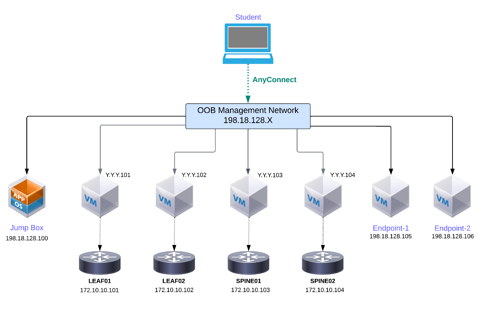

# Lab 1 Guide: SONiC Topology Setup and Validation [30 Min]

### Description: 
In Lab 1 we will explore the host-VM virtualization environment and log into the sonic-vs nodes and perform some system validation. The 4-node setup in Lab 1 will be used in all subsequent lab exercises. 

## Contents
- [Lab 1 Guide: SONiC Topology Setup and Validation \[30 Min\]](#lab-1-guide-sonic-topology-setup-and-validation-30-min)
    - [Description:](#description)
  - [Contents](#contents)
  - [Lab Objectives](#lab-objectives)
  - [Virtualization Stack](#virtualization-stack)
  - [Validate Device Access](#validate-device-access)
    - [User Credentials](#user-credentials)
    - [Management Network Topology](#management-network-topology)
    - [vsonic Boot Script](#vsonic-boot-script)
    - [Virsh and brctl Commands](#virsh-and-brctl-commands)
    - [Connect to SONiC Routers](#connect-to-sonic-routers)
  - [End of Lab 1](#end-of-lab-1)
  
## Lab Objectives
The student upon completion of Lab 1 should have achieved the following objectives:

* Access to all devices in the lab
* Understand the KVM/qemu virtualization environment and virsh utility
* Understanding of the lab topology and components
* Access the SONiC nodes   

## Virtualization Stack

The software virtualization stack used in this lab consists of several layers. At the base Linux OS level it is possible to run this lab either on bare metal or in a virtualized environment. In our dCloud lab we're running the router topology inside a host Ubuntu VM. The routers themselves are the SONiC-VS KVM/qemu image (https://sonic.software/) and the Linux virsh utility to launch and shutdown VMs. Each sonic-vs nodes' attributes (cpu, memory, interfaces, etc.) are defined in a virsh xml file found here: https://github.com/scurvy-dog/sonic-dcloud/tree/main/1-Intro_to_SONiC_Lab/util/kvm

For connectivity between virtual routers we use point-to-point UDP tunnels within the host-VM. Connectivity could also be done through Linux bridge or OVS instances, but the UDP tunnel option allows the routers to exchange LLDP messages directly without bridge interference. For connecitivty between the SONiC VMs and external test VM clients are using linux bridges.


## Validate Device Access

Device access for this lab is primarly through SSH. All of the VMs within this toplogy can be accessed once you connect through Cisco AnyConnect VPN to the dCloud environment. Please see the management topology network diagram below. The vsonic VM acts as a jumpbox for our 4 sonic-vs routers, thus we will SSH into the vsonic VM and then initiate a separate SSH session to each of the routers. The vsonic VM has an /etc/hosts entry for each router name to save time.

```
cisco@vsonic:~$ ping leaf01
PING leaf01 (172.10.10.4) 56(84) bytes of data.
64 bytes from leaf01 (172.10.10.4): icmp_seq=1 ttl=64 time=0.480 ms
64 bytes from leaf01 (172.10.10.4): icmp_seq=2 ttl=64 time=0.362 ms
```

### User Credentials
For the vsonic VM use the following credentials:
```
User: cisco, Password: C1sco12345
```

For all instances you will use the same user credentials:
```
User: cisco, Password: cisco123
```

### Management Network Topology



For full size image see [LINK](../topo-drawings/management-network.png)

### vsonic Boot Script


### Virsh and brctl Commands
There should have been several Linux bridges created for connectivity 
```
brctl show
```
```
cisco@vsonic:~$ brctl show
bridge name	bridge id		STP enabled	interfaces	
leaf01-host1		8000.0050568625d2	no		eth1  <----- Connection to Endpoint1
							vnet3
leaf02-host2		8000.00505686df6a	no		eth2  <----- Connection to Endpoint2
							vnet5
mgt-net		8000.52540005d85b	yes		mgt-net-nic   <----- Connection to mgmt port in vSONiC
							vnet0
							vnet1
							vnet2
							vnet4
virbr0		8000.5254007c5aa2	yes		virbr0-nic
```

To see the status of the four SONiC VM run the following command
```
virsh list
```

You should see the below output if all is well in the world.
```
cisco@vsonic:~$ virsh list
 Id    Name                           State
----------------------------------------------------
 1     spine01                        running
 2     spine02                        running
 3     leaf01                         running
 4     leaf02                         running
```

### Connect to SONiC Routers

Starting from the vsonic VM log into each router instance 1-4 per the management topology diagram above. Example:
```
    ssh cisco@spine01
    ssh cisco@spine02
    ssh cisco@leaf01
    ssh cisco@leaf02
    or
    ssh cisco@172.10.10.2
    ssh cisco@172.10.10.3
    ssh cisco@172.10.10.4
    ssh cisco@172.10.10.5
```
> **NOTE**
> Password for SONiC instances is cisco123
> 
Example:
```
cisco@vsonic:~$ ssh cisco@172.10.10.2
Warning: Permanently added '172.10.10.2' (RSA) to the list of known hosts.
cisco@172.10.10.2's password: 
Linux sonic 5.10.0-18-2-amd64 #1 SMP Debian 5.10.140-1 (2022-09-02) x86_64
You are on
  ____   ___  _   _ _  ____
 / ___| / _ \| \ | (_)/ ___|
 \___ \| | | |  \| | | |
  ___) | |_| | |\  | | |___
 |____/ \___/|_| \_|_|\____|

-- Software for Open Networking in the Cloud --

Unauthorized access and/or use are prohibited.
All access and/or use are subject to monitoring.

Help:    https://sonic-net.github.io/SONiC/

Last login: Wed Aug 16 04:02:54 2023
cisco@sonic:~$ 
```

## End of Lab 1
Please proceed to [Lab 2](https://github.com/scurvy-dog/sonic-dcloud/blob/main/1-Intro_to_SONiC_Lab/lab_2/lab_2-guide.md)
