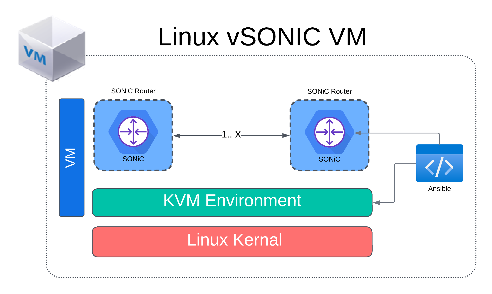

# Lab 1 Guide: SONiC Topology Setup and Validation [30 Min]
This dCloud lab makes heavy use of the relatively new Dockerized Cisco 8000 hardware emulator. If you wish to explore Cisco 8000 emulator and its uses beyond the scope of this lab the document team has posted an installation guide here: https://www.cisco.com/c/en/us/support/routers/8000-series-virtual-router-emulator/series.html

The lab also uses the open-source Containerlab tool for deploying our virtual network topology. More info on Containerlab may be found here: https://containerlab.dev/

And an example containerlab topology using Cisco 8000 HW Emulator running IOS-XR can be found here:
https://github.com/brmcdoug/containerlab/tree/main/vxr8000

### Description: 
In Lab 1 the student will launch the SONiC topology and validate it is up and running. This will be the baseline 
topology for all subsequent lab exercises. 

## Contents
- [Lab 1 Guide: SONiC Topology Setup and Validation \[30 Min\]](#lab-1-guide-sonic-topology-setup-and-validation-30-min)
    - [Description:](#description)
  - [Contents](#contents)
  - [Lab Objectives](#lab-objectives)
  - [Virtualization Stack](#virtualization-stack)
  - [Validate Device Access](#validate-device-access)
    - [User Credentials](#user-credentials)
    - [Management Network Topology](#management-network-topology)
    - [Validate VM Endpoints](#validate-vm-endpoints)
  - [Launch and Validate SONiC Topology](#launch-and-validate-sonic-topology)
    - [Validate vSONiC State](#validate-vsonic-state)
    - [Launch Container Lab Environment](#launch-container-lab-environment)
    - [Connect to Routers](#connect-to-routers)
  - [End of Lab 1](#end-of-lab-1)
  
## Lab Objectives
The student upon completion of Lab 1 should have achieved the following objectives:

* Access to all devices in the lab
* Understand the Cisco 8000 Emulator / SONiC stack
* Understanding of the lab topology and components
* Launch the ContainerLab SONiC topology and access the SONiC nodes   

## Virtualization Stack

The software virtualization stack used in this lab consists of several layers. At the base Linux OS level it is possible to run this lab either on bare metal or in a virtualized environment. In our dCloud lab it is running within a hypervisor as a VM. Within the Ubuntu VM named *v-SONiC* we have installed Docker as our container platform. We will user the ContainerLab software to spin up a docker containers that runs the Cisco 8000 hardware emulation software and point the emulator to boot the designated SONiC image. We will spin a single heavy container for each SONiC router needed. See the below diagram.



## Validate Device Access

Device access for this lab is primarly through SSH. All of the VMs within this toplogy can be accessed once you connect through Cisco AnyConnect VPN to the dCloud environment. Please see the management topology network diagram below. In addition we will launch four SONiC routers instances running as containers on the VM host "vSONiC". The vSONiC VM acts as a jumpbox for these containerized routers, thus we will SSH into the vSONiC VM and then initiate a separate SSH session to each of the routers. The vSONiC VM is configured for DNS resolution for each router name to save time.

### User Credentials
For the vSONiC VM use the following credentials:
```
User: cisco, Password: C1sco12345
```

For all instances you will use the same user credentials:
```
User: cisco, Password: cisco123
```

### Management Network Topology


For full size image see [LINK](../topo-drawings/management-network.png)

### Validate VM Endpoints


## Launch and Validate SONiC Topology
### Validate vSONiC State
1. SSH to the Ubuntu VM **vSONiC** where we will launch the XRd routers
    ```
    ssh cisco@198.18.128.100
    ```

2. Change to the Git repository directory and check status
    - The lab repository folder is found in the home directory *`~/sonic-dcloud/`*
    ```
    cd ~/sonic-dcloud/
    ```
    - The repository should automatically update on the lab spin-up. Validate this.
    ```
    git fetch -v
    ```
    ```
    cisco@vsonic:~/sonic-dcloud$ git fetch -v
    From https://github.com/scurvy-dog/sonic-dcloud
    = [up to date]      main       -> origin/main
    ```
    If it is not up to date then you need to update the repository before launching. Run
   ```
   git pull
   ```

4. Validate there are no docker containers running in our SONiC/Containerlab topology
    ```
    docker ps
    ```
    ```
    cisco@vsonic:~/sonic-dcloud/$ docker ps
    CONTAINER ID   IMAGE     COMMAND   CREATED   STATUS    PORTS     NAMES
    ```
### Launch Container Lab Environment
1. Change into the lab-1 directory and run the *`nets.sh`* script. This script will built linux bridge instances to connect our SONiC nodes with the external endpoint VMs.
   ```
   cd ~/sonic-dcloud/1-Intro_to_SONiC_Lab/lab_1
   sudo ./nets.sh
   ```
   Confirm bridges were created succesfully
   ```
   brctl show
   ```
   ```
   cisco@vsonic:~/sonic-dcloud/1-Intro_to_SONiC_Lab/lab_1$ brctl show
   bridge name	bridge id		STP enabled	interfaces
   docker0		8000.0242abf3a8e0	no		
   leaf01e32-host1		8000.005056a9ff8a	no		eth1
   leaf02e32-host2		8000.005056a992aa	no		eth2
   ```
    
2. Use Containerlab to launch the topology
    ```
    sudo containerlab deploy -t clab-topology.yml
    ```

   Expected Output
   ```
   cisco@vsonic:~/sonic-dcloud/1-Intro_to_SONiC_Lab/lab_1$ sudo containerlab deploy -t clab-topology.yml 
   INFO[0000] Containerlab v0.40.0 started                 
   INFO[0000] Parsing & checking topology file: topology.yml 
   INFO[0000] Creating lab directory: /home/cisco/sonic-dcloud/1-Intro_to_SONiC_Lab/lab_1/clab-c8201-sonic-4-node-clos 
   INFO[0000] Creating docker network: Name="mgt_net", IPv4Subnet="172.10.10.0/24", IPv6Subnet="2001:172:10:10::/80", MTU="1500" 
   INFO[0000] Creating container: "spine01"                
   INFO[0001] Creating container: "spine02"                
   INFO[0002] Creating container: "leaf01"                 
   INFO[0003] Creating container: "leaf02"                 
   INFO[0004] Creating virtual wire: spine01:eth3 <--> leaf02:eth3 
   INFO[0004] Creating virtual wire: leaf02:eth5 <--> leaf02e32-host2:leaf02eth5 
   INFO[0004] Creating virtual wire: spine01:eth1 <--> leaf01:eth1 
   INFO[0004] Creating virtual wire: spine02:eth3 <--> leaf01:eth3 
   INFO[0004] Creating virtual wire: spine01:eth2 <--> leaf01:eth2 
   INFO[0004] Creating virtual wire: spine01:eth4 <--> leaf02:eth4 
   INFO[0004] Creating virtual wire: spine02:eth4 <--> leaf01:eth4 
   INFO[0004] Creating virtual wire: spine02:eth1 <--> leaf02:eth1 
   INFO[0004] Creating virtual wire: spine02:eth2 <--> leaf02:eth2 
   INFO[0004] Creating virtual wire: leaf01:eth5 <--> leaf01e32-host1:leaf01eth5 
   INFO[0006] Adding containerlab host entries to /etc/hosts file 
   INFO[0006] 🎉 New containerlab version 0.43.0 is available! Release notes: https://containerlab.dev/rn/0.43/
   Run 'containerlab version upgrade' to upgrade or go check other installation options at https://containerlab.dev/install/ 
   +---+--------------------------------------+--------------+---------------------+-------+---------+----------------+----------------------+
    | # |                 Name                 | Container ID |        Image        | Kind  |  State  |  IPv4 Address  |     IPv6 Address     |
   +---+--------------------------------------+--------------+---------------------+-------+---------+----------------+----------------------+
   | 1 | clab-c8201-sonic-4-node-clos-leaf01  | f7a45e580658 | c8000-clab-sonic:29 | linux | running | 172.10.10.4/24 | 2001:172:10:10::4/80 |
   | 2 | clab-c8201-sonic-4-node-clos-leaf02  | 5493543b19a6 | c8000-clab-sonic:29 | linux | running | 172.10.10.5/24 | 2001:172:10:10::5/80 |
   | 3 | clab-c8201-sonic-4-node-clos-spine01 | 7d76479d7d84 | c8000-clab-sonic:29 | linux | running | 172.10.10.2/24 | 2001:172:10:10::2/80 |
   | 4 | clab-c8201-sonic-4-node-clos-spine02 | bc2bcb119c92 | c8000-clab-sonic:29 | linux | running | 172.10.10.3/24 | 2001:172:10:10::3/80 |
   +---+--------------------------------------+--------------+---------------------+-------+---------+----------------+----------------------+
   cisco@vsonic:~/sonic-dcloud/1-Intro_to_SONiC_Lab/lab_1$ 
   ```
   
    > **Note**
    > Containerlab command to shutdown the topology:
    ```
    sudo containerlab destroy -t clab-topology.yml
    ```
    
3. Check that the docker containers were created and running
    ```
    docker ps
    ```
    ```
    cisco@vsonic:~/sonic-dcloud/1-Intro_to_SONiC_Lab/lab_1$ docker ps
    CONTAINER ID   IMAGE                 COMMAND                  CREATED              STATUS              PORTS     NAMES
    e482535a8fa3   c8000-clab-sonic:29   "/etc/prepEnv.sh /no…"   About a minute ago   Up About a minute             clab-c8201-sonic-4-node-clos-leaf02
    43646051366d   c8000-clab-sonic:29   "/etc/prepEnv.sh /no…"   About a minute ago   Up About a minute             clab-c8201-sonic-4-node-clos-leaf01
    10b9bda5a913   c8000-clab-sonic:29   "/etc/prepEnv.sh /no…"   About a minute ago   Up About a minute             clab-c8201-sonic-4-node-clos-spine02
    50399c8f057d   c8000-clab-sonic:29   "/etc/prepEnv.sh /no…"   About a minute ago   Up About a minute             clab-c8201-sonic-4-node-clos-spine01
    ```
    
    > **Note**
    > It takes 10-15 minutes for the C8000 HW Emulators to load the SONiC image, detect virtual hardware and boot up. You can monitor progress using the docker logs command

    ```
    docker logs clab-c8201-sonic-4-node-clos-leaf01
    ```

4. After 10-15 minutes validate the SONiC instance started in each container. 
   Use the docker log command to search to see if the SONiC router started successfully. Repeat command for each container name.
   
   - clab-c8201-sonic-4-node-clos-leaf01
   - clab-c8201-sonic-4-node-clos-leaf02
   - clab-c8201-sonic-4-node-clos-spine01
   - clab-c8201-sonic-4-node-clos-spine02
   
   ```
   docker logs clab-c8201-sonic-4-node-clos-leaf01 | grep Router
   ```
   ```
   cisco@vsonic:~$ docker logs clab-c8201-sonic-4-node-clos-leaf01 | grep Router
   Router up
   ```
> **Warning**
> It is possible that the Containerlab process failed to start the router SONiC image after the docker container was created. If you see a *Router failed to come up* message follow the below process.

1. Docker exec into container bash shell:
   ```
   docker exec -it clab-c8201-sonic-4-node-clos-leaf02 bash
   ```
   Example:
   ```
   cisco@vsonic:~$ docker exec -it clab-c8201-sonic-4-node-clos-leaf01 bash
   root@leaf01:/#
   ```
2. cd into the *`nobackup`* directory and manually run the startup.py script. We're manually re-applying/booting the SONiC image, so expect the script to run for about 10-15 minutes
   
    > **Note** 
    > The script wants an interface count. In the containerlab topology our spine nodes have 4 interfaces and leaf nodes have 5:
   ```
   cd nobackup
   ./startup.py 8000.yaml 5
   ```
   Example:
```
cisco@vsonic:~$ docker exec -it clab-c8201-sonic-4-node-clos-leaf01 bash
root@leaf01:/# cd nobackup/
root@leaf01:/nobackup# ./startup.py 8000.yaml 5
['./startup.py', '8000.yaml', '5']
MGMT_IP: 172.10.10.4  MASK: 255.255.255.0  GATEWAY: 172.10.10.1
Found 5 data interfaces (expected 5)
[Wed Aug 16 03:59:50 2023] sudo ip address flush dev eth1
[Wed Aug 16 03:59:50 2023] sudo ip link set up dev eth1
<snip>
04:01:37 INFO R0:waiting for SONIC login prompt after 'onie-nos-install sonic-cisco-8000-clab.bin' (console output captured in vxr.out/logs/console.R0.log)
    < it takes 6-8 minutes for the onie-nos-install portion of the load process to complete >

04:08:04 INFO R0:got login prompt. Attempting to re-login.
04:08:04 INFO R0:onie sonic login cisco/cisco123
04:08:04 INFO R0:entering sonic username 'cisco'
04:08:04 INFO R0:entering sonic password 'cisco123'
04:08:04 INFO R0:reached sonic prompt
04:08:04 INFO R0:reached sonic prompt
04:08:04 INFO R0:login successful
04:08:04 INFO R0:wait for swss to enter active state
04:08:24 INFO R0:swss in active state
04:08:24 INFO R0:wait for SONIC interfaces to get created
04:08:24 INFO R0:onie sonic login cisco/cisco123
04:08:25 INFO R0:reached sonic prompt
04:08:25 INFO R0:checking interfaces
04:08:28 INFO R0:found 0 interfaces (expected 32)
04:08:59 INFO R0:found 0 interfaces (expected 32)
04:09:32 INFO R0:found 0 interfaces (expected 32)
04:10:04 INFO R0:found 0 interfaces (expected 32)
04:10:36 INFO R0:found 0 interfaces (expected 32)
04:11:08 INFO R0:found 0 interfaces (expected 32)
04:11:40 INFO R0:found 32 interfaces (expected 32)
04:11:40 INFO R0:applying XR config
04:11:56 INFO Sim up
root@leaf01:/nobackup# exit
exit
cisco@vsonic:~$ 
```

3. At the *`Sim up`* message you can exit the container and proceed to ssh to the routers

### Connect to Routers

1. Starting from the vSONiC VM log into each router instance 1-4 per the management topology diagram above. Example:
    ```
    ssh cisco@172.10.10.2
    or
    ssh cisco@spine01
    pw = cisco123
    ```
Example:
```
cisco@vsonic:~$ ssh cisco@172.10.10.2
Warning: Permanently added '172.10.10.2' (RSA) to the list of known hosts.
cisco@172.10.10.2's password: 
Linux sonic 5.10.0-18-2-amd64 #1 SMP Debian 5.10.140-1 (2022-09-02) x86_64
You are on
  ____   ___  _   _ _  ____
 / ___| / _ \| \ | (_)/ ___|
 \___ \| | | |  \| | | |
  ___) | |_| | |\  | | |___
 |____/ \___/|_| \_|_|\____|

-- Software for Open Networking in the Cloud --

Unauthorized access and/or use are prohibited.
All access and/or use are subject to monitoring.

Help:    https://sonic-net.github.io/SONiC/

Last login: Wed Aug 16 04:02:54 2023
cisco@sonic:~$ 
```

## End of Lab 1
Please proceed to [Lab 2](https://github.com/scurvy-dog/sonic-dcloud/blob/main/1-Intro_to_SONiC_Lab/lab_2/lab_2-guide.md)
