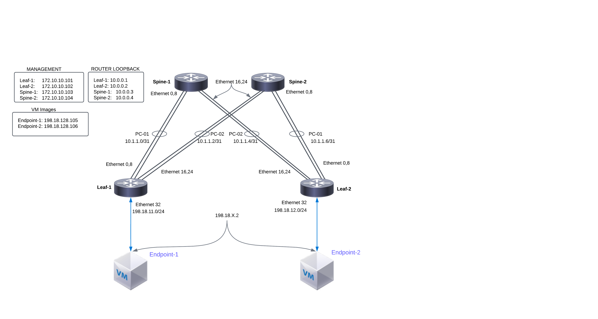

d# Lab 2 Guide: Explore SONiC NOS [40 Min]

### Description: 
In Lab 2 the student will explore the SONiC network operating system, its components, services, config management, and CLI. Second, they will run an Ansible script to apply global and interface configurations to the nodes in our topology. And finally we will validate connectivity between SONiC nodes and from SONiC nodes to our endpoint VMs.

## Contents
- [Contents](#contents)
- [Lab Objectives](#lab-objectives)
- [Tour of SONiC](#tour-of-sonic)
  - [SONiC Software Architecture](#sonic-software-architecture)
  - [Health Check of SONiC Components](#health-check-of-sonic-components)
  - [Health Check of Hardware Components](#health-check-of-hardware-components)
  - [Managing Configurations](#managing-configurations)
    - [Loading configuration from JSON file](#loading-configuration-from-json-file)
    - [Reloading configuration](#reloading-configuration)
    - [Saving Configuration to a File for Persistence](#saving-configuration-to-a-file-for-persistence)
    - [Edit Configuration Through CLI](#edit-configuration-through-cli)
    - [FRR Configuration Management](#frr-configuration-management)
- [Ansible Automation](#ansible-automation)
- [Network Connectivity](#network-connectivity)
- [End of Lab 2](#end-of-lab-2)
  
## Lab Objectives
The student upon completion of Lab 2 should have achieved the following objectives:

* Understanding of the software components within SONiC
* Ability to see status of various services
* Configuration Management structure
* How to load configuration through Ansible
* Valadiate end to end topology 

## Tour of SONiC
### SONiC Software Architecture
SONiC system's architecture comprises of various modules that interact among each other through a centralized and scalable infrastructure. This infrastructure relies on the use of a redis-database engine: a key-value database to provide a language independent interface, a method for data persistence, replication and multi-process communication among all SONiC subsystems.
    
By relying on the publisher/subscriber messaging paradigm offered by the redis-engine infrastructure, applications can subscribe only to the data-views that they require, and avoid implementation details that are irrelevant to their functionality.

SONiC places each module in independent docker containers to keep high cohesion among semantically-affine components, while reducing coupling between disjointed ones. Each of these components are written to be entirely independent of the platform-specific details required to interact with lower-layer abstractions. See diagram below for high level architecture view.


As of today, SONiC breaks its main functional components into the following docker containers:

| Service Container | Description                                                      |
|:------------------|:-----------------------------------------------------------------|
| BGP               | Runs Quagga or FRR. These stacks include other routing protocols |
| Database          | Hosts the redis-database engine|
| DHCP-Relay        | DHCP-Relay agent |
| LLDP              | Hosts LLDP. Includes 3 process *llpd*, *LLDP-syncd*, *LLDPmgr* |
| MGMT-Framework    | North Bound Interfaces (NBIs) for  managing configuration and status|
| PMON              | Runs *sensord* daemon used to log and alert sensor data |
| RADV              |
| SNMP              | Hosts SNMP feature. *SNMPD* and *SNMP-Agent* |
| SWSS              | Collection of tools to allow communication among all SONiC modules |
| SYNCD             | synchronization of the switch's network state with the switch's actual hardware/ASIC |
| TeamD             | Runs open-source implementation of LAG protocol |

You can see the list of the running containers with SONiC by running the below command once logged into a SONiC device.
```
docker ps
```
```
admin@leaf01:~$ docker ps
CONTAINER ID   IMAGE                                COMMAND                  CREATED       STATUS       PORTS     NAMES
d3dec180edf1   docker-sonic-telemetry:latest        "/usr/local/bin/supe…"   7 hours ago   Up 3 hours             telemetry
73408f13ba26   docker-snmp:latest                   "/usr/local/bin/supe…"   7 hours ago   Up 3 hours             snmp
dd0fcc119898   docker-platform-monitor:latest       "/usr/bin/docker_ini…"   7 hours ago   Up 3 hours             pmon
b5bfcb99ed76   docker-sonic-mgmt-framework:latest   "/usr/local/bin/supe…"   7 hours ago   Up 3 hours             mgmt-framework
a897bd933245   docker-lldp:latest                   "/usr/bin/docker-lld…"   7 hours ago   Up 3 hours             lldp
48663b8df8f6   docker-router-advertiser:latest      "/usr/bin/docker-ini…"   7 hours ago   Up 3 hours             radv
ce538630853c   docker-gbsyncd-vs:latest             "/usr/local/bin/supe…"   7 hours ago   Up 3 hours             gbsyncd
1206abe29dc5   docker-fpm-frr:latest                "/usr/bin/docker_ini…"   7 hours ago   Up 3 hours             bgp
b702fb2043ee   docker-syncd-vs:latest               "/usr/local/bin/supe…"   7 hours ago   Up 3 hours             syncd
6132ac862c62   docker-teamd:latest                  "/usr/local/bin/supe…"   7 hours ago   Up 3 hours             teamd
d3cb89acd257   docker-orchagent:latest              "/usr/bin/docker-ini…"   7 hours ago   Up 3 hours             swss
a0355d7eb56b   docker-eventd:latest                 "/usr/local/bin/supe…"   7 hours ago   Up 3 hours             eventd
c002ab9b311f   docker-database:latest               "/usr/local/bin/dock…"   7 hours ago   Up 3 hours             database
```
> **Note**
>For greater detail on container services see this link [HERE](https://github.com/sonic-net/SONiC/wiki/Architecture)

### Health Check of SONiC Components
**show system-health monitor-list**

This command gives an overview of the software and hardware  status. Notice all the hardware outputs are listed as **Not OK** as this is in a simulated environment. 
```
cisco@spine01:~$ sudo show system-health monitor-list

System services and devices monitor list

Name                        Status    Type
--------------------------  --------  ----------
routeCheck                  Not OK    Program
container_checker           Not OK    Program
telemetry                   Not OK    Service
spine01                     OK        System
rsyslog                     OK        Process
root-overlay                OK        Filesystem
var-log                     OK        Filesystem
diskCheck                   OK        Program
vnetRouteCheck              OK        Program
memory_check                OK        Program
container_memory_telemetry  OK        Program
container_memory_snmp       OK        Program
database:redis              OK        Process
lldp:lldpd                  OK        Process
lldp:lldp-syncd             OK        Process
lldp:lldpmgrd               OK        Process
syncd:syncd                 OK        Process
bgp:zebra                   OK        Process
bgp:staticd                 OK        Process
bgp:bgpd                    OK        Process
bgp:fpmsyncd                OK        Process
bgp:bgpcfgd                 OK        Process
teamd:teammgrd              OK        Process
teamd:teamsyncd             OK        Process
teamd:tlm_teamd             OK        Process
swss:orchagent              OK        Process
swss:portsyncd              OK        Process
swss:neighsyncd             OK        Process
swss:fdbsyncd               OK        Process
swss:vlanmgrd               OK        Process
swss:intfmgrd               OK        Process
swss:portmgrd               OK        Process
swss:buffermgrd             OK        Process
swss:vrfmgrd                OK        Process
swss:nbrmgrd                OK        Process
swss:vxlanmgrd              OK        Process
swss:coppmgrd               OK        Process
swss:tunnelmgrd             OK        Process
snmp:snmpd                  OK        Process
snmp:snmp-subagent          OK        Process
PSU0.fan0                   Not OK    Fan
PSU1.fan0                   Not OK    Fan
fantray0.fan0               Not OK    Fan
fantray0.fan1               Not OK    Fan
fantray1.fan0               Not OK    Fan
fantray1.fan1               Not OK    Fan
fantray2.fan0               Not OK    Fan
fantray2.fan1               Not OK    Fan
fantray3.fan0               Not OK    Fan
fantray3.fan1               Not OK    Fan
fantray4.fan0               Not OK    Fan
fantray4.fan1               Not OK    Fan
fantray5.fan0               Not OK    Fan
fantray5.fan1               Not OK    Fan
PSU 1                       Not OK    PSU
PSU 2                       Not OK    PSU
```

### Health Check of Hardware Components

**show system-health summary**

### Managing Configurations
Configuration state in SONiC is perserved into several places. For persistant configuratin between reloads configuration files are used. The main configuration is found at */etc/sonic/config_db.json*. The second configuration file in this lab is for the FRR routing stack and it's configuratin is found at */etc/sonic/frr/bgpd.conf*. When the router boots it loads the configuration into these two files into the redis database. The redis database is the running configuration of the router where the various services read or write state information into the redis database.


#### Loading configuration from JSON file

The command *config load* is used to load the configuration from a JSON file like the file which SONiC saves its configuration to, */etc/sonic/config_db.json* This command loads the configuration from the input file (if user specifies this optional filename, it will use that input file. Otherwise, it will use the default */etc/sonic/config_db.json* file as the input file) into CONFIG_DB. The configuration present in the input file is applied on top of the already running configuration. This command does not flush the config DB before loading the new configuration (i.e., If the configuration present in the input file is same as the current running configuration, nothing happens) If the config present in the input file is not present in running configuration, it will be added. If the config present in the input file differs (when key matches) from that of the running configuration, it will be modified as per the new values for those keys.

- Usage:
```
config load [-y|--yes] [<filename>]
```
- Example:
```
cisco@spine01:~$ sudo config load
Load config from the file /etc/sonic/config_db.json? [y/N]: y
Running command: /usr/local/bin/sonic-cfggen -j /etc/sonic/config_db.json --write-to-db
```

#### Reloading configuration

This command is used to clear current configuration and import new configurationn from the input file or from */etc/sonic/config_db.json*. This command shall stop all services before clearing the configuration and it then restarts those services.

The command *config reload* restarts various services running in the device and it takes some time to complete the command.
> **NOTE**
> If the user had logged in using SSH, users might get disconnected depending upon the new management IP address. Users need to reconnect their SSH sessions.

- Usage:
```
config reload [-y|--yes] [-l|--load-sysinfo] [<filename>] [-n|--no-service-restart] [-f|--force]
```
- Example:
```
cisco@spine01~$ sudo config reload
Clear current config and reload config from the file /etc/sonic/config_db.json? [y/N]: y
Running command: systemctl stop dhcp_relay
Running command: systemctl stop swss
Running command: systemctl stop snmp
Warning: Stopping snmp.service, but it can still be activated by:
  snmp.timer
Running command: systemctl stop lldp
Running command: systemctl stop pmon
Running command: systemctl stop bgp
Running command: systemctl stop teamd
Running command: /usr/local/bin/sonic-cfggen -H -k Force10-Z9100-C32 --write-to-db
Running command: /usr/local/bin/sonic-cfggen -j /etc/sonic/config_db.json --write-to-db
Running command: systemctl restart hostname-config
Running command: systemctl restart interfaces-config
Timeout, server 10.11.162.42 not responding.
```

#### Saving Configuration to a File for Persistence

The command *config save* is used to save the config DB configuration into the user-specified filename or into the default /etc/sonic/config_db.json. This saves the configuration into the disk which is available even after reboots. Saved file can be transferred to remote machines for debugging. If users wants to load the configuration from this new file at any point of time, they can use "config load" command and provide this newly generated file as input. If users wants this newly generated file to be used during reboot, they need to copy this file to /etc/sonic/config_db.json.

- Usage:
```
config save [-y|--yes] [<filename>]
```
- Example (Save configuration to /etc/sonic/config_db.json):

```
cisco@spine01:~$ sudo config save -y
```

- Example (Save configuration to a specified file):
```
cisco@spine01:~$ sudo config save -y /etc/sonic/config2.json
```

#### Edit Configuration Through CLI

Configuration management is also possible through the CLI. From the SONiC command prompt enter *config* and the command syntax needed. 
```
cisco@leaf01:~$ config -?
Usage: config [OPTIONS] COMMAND [ARGS]...

  SONiC command line - 'config' command
```

#### FRR Configuration Management

FRR is an open-source routing stack that supports multiple protocols. In this lab we will focus on BGP routing protocol. 

First FRR stores it's configuration in a separate file located at */etc/sonic/frr/bgpd.conf*. There are different methods to manage the configuration for FRR.


**View Startup FRR Configuration**
```
show startupconfiguration bgp
```

**View Running FRR Configuration**
```
 show run bgp
```
**Save Running FRR Configuration to File**
```
vtsysh
copy run start
```

## Ansible Automation
In this lab we are going to use an Ansible playbook to create the baseline configuration in the topology. That means we are going to replace the */etc/sonic/config_db.json* which will contain global parameters an link setup with IP addresses.

There are several relevant files for our ansible playbook

| Name                  | Location             | Notes                         |
|:----------------------|:---------------------|:------------------------------|
| sonic-playbook.yml    | /lab_2/ansible       | Ansible playbook file         |
| hosts                 | /lab_2/ansible       | Contains device list and IPs  |
| config_db.json        | /files/{host}/       | Global configuration file     |

- Change to the ansible directory in lab 2
  ```
  cd ansible
  ```
- Run Ansible playbook to copy configurations to SONiC routers. Once copied then load configurations
    ```
    ansible-playbook -i hosts sonic-playbook.yml -e "ansible_user=cisco ansible_ssh_pass=cisco123 ansible_sudo_pass=cisco123" -vv
    ```

    You should expect a large amount of output from ansible but, at the end of logs look for the following output
    ```
    PLAY RECAP
    ***************************************************************************************************************************************
    leaf01                     : ok=5    changed=1    unreachable=0    failed=0    skipped=0    rescued=0    ignored=0   
    leaf02                     : ok=5    changed=1    unreachable=0    failed=0    skipped=0    rescued=0    ignored=0   
    spine01                    : ok=5    changed=1    unreachable=0    failed=0    skipped=0    rescued=0    ignored=0   
    spine02                    : ok=5    changed=1    unreachable=0    failed=0    skipped=0    rescued=0    ignored=0
    ```

## Network Connectivity
Now is the time to validate that all of the links between nodes in the topology have been successfully brought up and IP addresses were assigned correctly.

It will take a minutes after ansible executes the config reload for the routers to be ready for testing.

To check on interface status and connectivity follow these steps on each router in the topology

**INTERFACES**
- Log into each router referencing the IP and login credentials in lab_1
- Check the interface status. The abbreviated output command for this would be. All interfaces should be in an UP/UP status
  
   ```
   show interface description
   ```
   For our vSONiC lab only configured interfaces that are mapped in KVM will show up/up status.
   ```
   cisco@spine01:~$ show int description
   Interface    Oper    Admin           Alias    Description
   -----------  ------  -------  --------------  -------------
   Ethernet0      up       up    fortyGigE0/0
   Ethernet4      up       up    fortyGigE0/4
   Ethernet8      up       up    fortyGigE0/8
   Ethernet12     up       up    fortyGigE0/12
   Ethernet16    down      up    fortyGigE0/16
   Ethernet20    down      up    fortyGigE0/24
   ```
- Show LLDP adjacency information to see interface remote neighbors

  ```
  show lldp table
  ```

  ```
  cisco@spine01:~$ show lldp table
  Capability codes: (R) Router, (B) Bridge, (O) Other
  LocalPort    RemoteDevice    RemotePortID    Capability    RemotePortDescr
  -----------  --------------  --------------  ------------  -----------------
  Ethernet0    leaf01          etp0            BR            Ethernet0
  Ethernet8    leaf01          etp1            BR            Ethernet8
  Ethernet16   leaf02          etp2            BR            Ethernet16
  Ethernet24   leaf02          etp3            BR            Ethernet24
  --------------------------------------------------
  Total entries displayed:  4
  ```

**PORT CHANNELS**
- Port Channel configuration in the running configuration has three parts.
  ```json
  "PORTCHANNEL": {                 <------ Port Channel Definition
        "PortChannel1": {
            "admin_status": "up",
            "lacp_key": "auto",
            "min_links": "1",
            "mtu": "9100"
        },
        "PortChannel2": {
            "admin_status": "up",
            "lacp_key": "auto",
            "min_links": "1",
            "mtu": "9100"
        }
    },
    "PORTCHANNEL_INTERFACE": {      <------ Port Channel IP Information 
        "PortChannel1": {},
        "PortChannel2": {},
        "PortChannel1|10.1.1.1/31": {},
        "PortChannel1|fc00:0:ffff::1/127": {},
        "PortChannel2|10.1.1.5/31": {},
        "PortChannel2|fc00:0:ffff::5/127": {}
    },
    "PORTCHANNEL_MEMBER": {         <------ Port Channel Member Links
        "PortChannel1|Ethernet0": {},
        "PortChannel1|Ethernet8": {},
        "PortChannel2|Ethernet16": {},
        "PortChannel2|Ethernet24": {}
  ```

- Check that the port-channels were created and look at the member links
   ```
   show interface portchannel
   ```
   ```
   cisco@sonic:~$ show interface portchannel
   Flags: A - active, I - inactive, Up - up, Dw - Down, N/A - not available,
       S - selected, D - deselected, * - not synced
   No.  Team Dev      Protocol     Ports
   -----  ------------  -----------  ---------------------------
    1  PortChannel1  LACP(A)(Up)  Ethernet0(S) Ethernet8(S)     <------ See LADP status Active
    2  PortChannel2  LACP(A)(Up)  Ethernet24(S) Ethernet16(S)   <------ See LADP status Active
   ```

**IP Adjaceny**
-    View the configured IP address as listed in the below diagram.



- Verify that IPs are configured on the SONiC routers
  ```
  show ip interfaces
  ```
  ```
  cisco@spine02:~$ show ip interfaces
  Interface     Master    IPv4 address/mask    Admin/Oper    BGP Neighbor    Neighbor IP
  ------------  --------  -------------------  ------------  --------------  -------------
  Loopback0               10.0.0.2/32          up/up         N/A             N/A
  PortChannel1            10.1.1.7/31          up/up         N/A             N/A
  PortChannel2            10.1.1.3/31          up/up         N/A             N/A
  docker0                 240.127.1.1/24       up/down       N/A             N/A
  eth0                    172.10.10.3/24       up/up         N/A             N/A
  eth4                    192.168.123.252/24   up/up         N/A             N/A
  lo                      127.0.0.1/16         up/up         N/A             N/A
  ```

- Ping the adjacent IP for the routed linnks
  ```
  cisco@spine02:~$ ping 10.1.1.2
  PING 10.1.1.2 (10.1.1.2) 56(84) bytes of data.
  64 bytes from 10.1.1.2: icmp_seq=1 ttl=64 time=573 ms
  64 bytes from 10.1.1.2: icmp_seq=2 ttl=64 time=387 ms
  ```
**Congratulations you have successfully completed Lab 2. You should now be ready to configure routing protocols.**

## End of Lab 2
Please proceed to [Lab 3](https://github.com/scurvy-dog/sonic-dcloud/blob/main/1-Intro_to_SONiC_Lab/lab_3/lab_3-guide.md)
