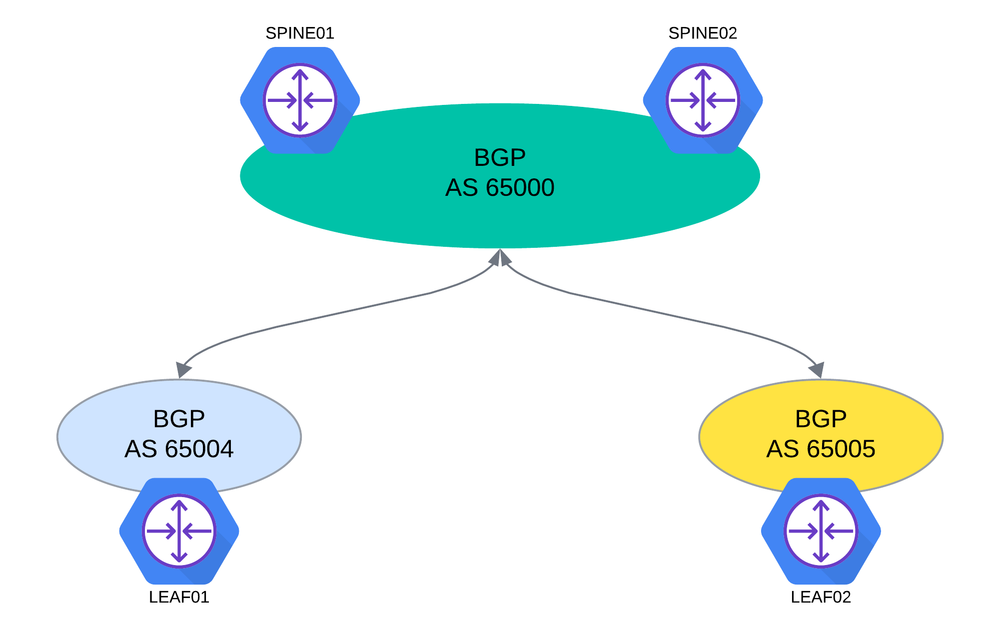

# Lab 3 Guide: Configure BGP [40 Min]

### Description: 
In Lab 3 the student will explore the configuring the BGP routing protocol within SONiC. In this lab the FRR routing protocol stack is used to provide BGP support. 

## Contents
- [Lab 3 Guide: Configure BGP \[40 Min\]](#lab-3-guide:-configure-bgp-40-min)
    - [Description:](#description)
    - [Lab Objectives](#lab-objectives)
    - [FRR BGP Overview](#frr-bgp-overview)
    - [BGP Topology](#bgp-topology)
    - [Ansible BGP Playbook](#ansible-bgp-playbook)
    - [Configure BGP Leaf01 with FRR CLI](#configure-bgp-leaf01-with-frr-cli)
    - [Validate BGP Peering](#validate-bgp-peering)
       - [Check BGP Neighbors]
       - [Check Routing Tables]
       - [Check Connectivity]     
   
  - [End of Lab 3](#end-of-lab-3)
  
## Lab Objectives
The student upon completion of Lab 3 should have achieved the following objectives:

* Understand FRR configuration
* How to validate and troubleshoot BGP sesions
* Valadiate end to end topology 

## FRR BGP Overview
FRR is the routing procotol software stack in this lab. FRR supports BGP and is integrated within SONiC running it's own daemon to process the configuration work we will be doing in this lab. There are several ways to configure FRR as noted in Lab 2. 

For this lab we will be using two mechanisms to configure FRR. The first is to use ansible to update the FRR config file */etc/sonic/frr/bgpd.conf*. When we do a config reload command it will load FRR will load the BGP configurations into the running configuration which is stored in the *redis-database*. We will use this method to load FRR/BGP configuration for *spine01*, *spine02*, and *leaf02*.

For *leaf01* you will be using the FRR CLI to add the BGP configuration. There are some items of note when using the FRR CLI in SONiC.
    - For all configuration commands, the CLI request is converted to a corresponding REST client SDK request based on the Open Config data model that was generated by the Swagger generator, and is given to the REST server
    - From there on it will follow the same path as a REST config request for create, update and delete operations

## BGP Topology
In this lab we will have three separate BGP AS represented in the fabric. The spine layer will be within it's own AS 65000. Each leaf will then have it's own separate BGP AS as represented in the topology diagram below. In this BGP DC fabric the leafs should be receiving equal cost paths through each of the spine layer port-channels through AS 65000.

## Ansible BGP Playbook

## Configure BGP Leaf01 with FRR CLI

## Validate BGP Peering

## End of Lab 3
Please proceed to [Lab 4](https://github.com/scurvy-dog/sonic-dcloud/blob/main/1-Intro_to_SONiC_Lab/lab_4/lab_4-guide.md)
