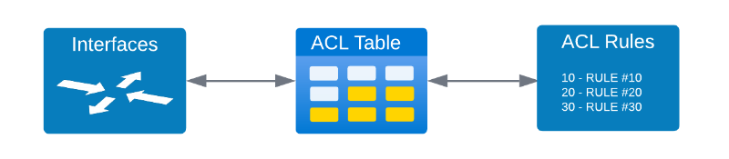

# Lab Exercise 4: ACL Overview and Config [30 Min]


### Description: 
In Lab Exercise 4 the student will explore how SONiC utilizes ACLs in dataplane and control plane application. An overview of where and how SONiC applies ACLs will be provided and configuration examples.

## Contents
- [Lab Exercise 4: ACL Overview and Config \[30 Min\]](#lab-exercise-4-acl-overview-and-config-30-min)
    - [Description:](#description)
  - [Contents](#contents)
  - [Lab Objectives](#lab-objectives)
  - [SONiC ACL Architecture](#sonic-acl-architecture)
    - [ACL Table Definition Types](#acl-table-definition-types)
    - [ACL Match Options](#acl-match-options)
  - [Basic ACL Walk Through](#basic-acl-walk-through)
    - [Add/Delete ACL Table](#acl-tables) 
    - [Add/Delete ACL Rule](#acl-rules)
  - [ACL Configuration Syntax](#acl-configuration-syntax)
  - [ACL Scale](#acl-scale)
  - [ACL Troubleshooting](#acl-troubleshooting)
  - [End of Lab 4](#end-of-lab-4)
  
## Lab Objectives
The student upon completion of Lab Exercise 4 should have achieved the following objectives:

* Understand types of ACLs SONiC Supports
* Basic ACL syntax construction
* Ability to apply ACLs in SONiC

## SONiC ACL Architecture

### ACL Table Definition Types

| Type                | Description                       | Ingress | Egress  | 
|:--------------------|:----------------------------------|:-------:|:-------:|
| L3                  | Match on IPv4 ACL                 | X       | X       |
| L3V6                | Match on IPv6 ACL                 | X       | X       |
| L3V4V6              | Match on IPv4 and v6 combined ACL | X       | X       |
| MIRROR              | Match on IPv4 ACL to mirror flow  | X       | X       |
| MIRRORV6            | Match on IPv6 ACL to mirror flow  | X       | X       |
| MIRROR_DSCP         | Match on DSCP ACL to mirror flow  | X       | X       |
| PFCWD               | Research                          | X       | X       |
| MLAG                | Research                          | X       | X       |
| MUX                 | Research                          | X       | X       |
| DROP                | Research                          | X       | X       |
| CTRLPLANE           | Research                          | X       | X       |
| DTEL_FLOW_WATCHLIST | Research                          | X       | X       |

### ACL Match Options

- For reference on Ethernet Header see this link [HERE](https://en.wikipedia.org/wiki/Ethernet_frame)
- For reference on IPv4 Packet Header see this link [HERE](https://en.wikipedia.org/wiki/Internet_Protocol_version_4#Header)
- For reference on IPv6 Packet Header see this link [HERE](https://en.wikipedia.org/wiki/IPv6#IPv6_packets)
- For reference on ICMP Packet Header see this link [HERE](https://en.wikipedia.org/wiki/Ping_(networking_utility)#ICMP_packet)
- For referenec on VXLAN Packet Header see this link [HERE](https://learningnetwork.cisco.com/s/blogs/a0D3i000005YebJEAS/introduction-to-vxlan)

| Type               | Description                                | Notes                                          | 
|:-------------------|:-------------------------------------------|:-----------------------------------------------|
| IN_PORTS           | Match Ingress Port                         |                                                |
| OUT_PORTS          | Match Egress Port                          |                                                |
| SRC_IP             | Match Source IPv4 Address                  | A valid IPv4 subnet in format IP/Mask          |
| DST_IP             | Match Destination IPv4 Address             | A valid IPv4 subnet in format IP/Mask          |
| SRC_IPV6           | Match Source IPv6 Address                  | A valid IPv6 subnet in format IP/Mask          |
| DST_IPV6           | Match Destination IPv6 Address             | A valid IPv6 subnet in format IP/Mask          |
| L4_SRC_PORT        | Match Source Layer 4 Port                  | Decimal integer [0..65535]                     |
| L4_DST_PORT        | Match Destination Layer 4 Port             | Decimal integer [0..65535]                     |
| L4_SRC_PORT_RANGE  | Match Source Layer 4 Port Range            | Two dash separated decimal integers [0..65535] |
| L4_DST_PORT_RANGE  | Match Destination Layer 4 Port Range       | Two dash separated decimal integers [0..65535] |
| ETHER_TYPE         | Match Ethernet Type Field                  |                                                |
| VLAN_ID            | Match VLAN ID                              |                                                |
| IP_PROTOCOL        | Match IP Protocol Number                   | Hexadecimal unsigned integer [0..FF]           |
| NEXT_HEADER        | Match IPv6 Next Header Field               |                                                |
| TCP_FLAGS          | Match TCP Flags Field                      | Hexadecimal unsigned integer [0..FF]           |
| IP_TYPE            | Match IPv4 Options Type Field              | String of one type of: "IPv4"/"NON_IPv4"/"ARP" |
| ETHER_TYPE         | Match Ethernet Type Field                  |                                                |
| DSCP               | Match IPv4 Header DSCP Field               | DSCP (6b)                                      |
| TC                 | Match IPv6 Header Traffic Class Field      | DSCP(6b) + ECN(2b)                             |
| ICMP_TYPE          | Match ICMPv4 ICMP Type Field               |                                                |
| ICMP_CODE          | Match ICMPv4 ICMP Code Field               |                                                |
| ICMPV6_TYPE        | Match ICMPv6 Type Field                    |                                                |
| ICMPV6_CODE        | Match ICMPv6 Options Field                 |                                                |
| TUNNEL_VNI         | Match VXLAN VNID Field                     | VNI (24b)                                      |
| INNER_ETHER_TYPE   | Match Inner Header Ethernet Type Field     | Research                                       |
| INNER_IP_PROTOCOL  | Match Inner Header IP Protocol Number      | Research                                       |
| INNER_L4_SRC_PORT  | Match Inner Header Source Layer 4 Port     | Research                                       |
| INNER_L4_DST_PORT  | Match Inner Header Destination Layer 4 Port| Research                                       |
| BTH_OPCODE         | Match ???                                  | Research                                       |
| AETH_SYNDROME      | Match ???                                  | Research                                       |

## Basic ACL Walk Through
The core of ACLs in SONiC is the ACL Table which links interfaces with rules and defines the direction of the policy enforcement.



### ACL Tables
ACL tables are of two types. Data Plane ACLs and Control Plane ACLS.
Data Plane tables purpose is to link a data plane traffic type to a set of defined interfaces. ACL Tables can be created using either CLI or through a JSON definition which is loaded into config. We will show both options in this lab. 

Data Plane ACL Tables have mandatory and optional defined fields as listed in the below table.

| Parameters | CLI Flag | Mandatory | Details                                          |
|:-----------|:--------:|:---------:|:-------------------------------------------------|
| table name | none     | X         | The name of the ACL table to create.             |
| table type | none     | X         | Type of ACL table to create. *See table above*   |
| description| -d       |           | Table description. Defaults to table name        |
| ports      | -p       |           | Binds table to physical port,portchannel, VLAN   |
| stage      | -s       |           | Valid options are ingress (default) or egress    |


**Adding ACL Table with CLI**
```
cisco@leaf-2:~$ sudo config acl add table --help
Usage: config acl add table [OPTIONS] <table_name> <table_type>
  Add ACL table

Options:
  -d, --description TEXT
  -p, --ports TEXT
  -s, --stage [ingress|egress]
```
```
sudo config acl add table ICMP_DROP L3 -p Ethernet32 -d "BLock ICMP traffic from Endpoint2" -s ingress
```
```
cisco@leaf-2:~$ sudo acl-loader show table
Name       Type    Binding     Description                        Stage    Status
---------  ------  ----------  ---------------------------------  -------  --------
ICMP_DROP  L3      Ethernet32  BLock ICMP traffic from Endpoint2  ingress  Active
```
**Remove ACL Table through CLI**
```
sudo config acl remove table ICMP_DROP
```
**Adding ACL Table through JSON**
To utilize JSON to create an ACL it is a two step process. First you must construct a valid JSON syntax file and store that on the SONiC router itself. The second step is to use the config load command to add the table into the running configuration. See steps below.

**Example of ACL Table JSON**
Save this json acl table definition to a file on the SONiC device as acl_table_icmp.json

```
{
"ACL_TABLE": {
            "ICMP_DROP": {
                    "policy_desc" : "Block IMCP traffic from endpoint 2",
                    "type" : "L3",
                    "stage": "ingress",
                    "ports" : [
                        "Ethernet32"
                    ] 
                    }
        }
}
```
**Loading the ACL table JSON file into the running config**
```
sudo config load acl_table_icmp.json
```

### ACL Rules
ACL Rules contain the detail step by step policy that is implemented by the tables. ACL Rule structure will identify which ACL Table they should be joined to. ACL Rules can only be defined using JSON and have no CLI option. We will show a basic ACL Rule used to block ICMP traffic coming from Endpoint-2 to *Loopback 0* on Leaf-2

**Example JSON file that should be saved as acl_rule_icmp.json** 

```
{
    "ACL_RULE": {
        "ICMP_INGRESS|ICMP_FORWARD": {
            "PACKET_ACTION": "FORWARD",
            "PRIORITY": "10",
            "SRC_IP": "198.18.12.1/32"
        },
        "ICMP_INGRESS|ICMP_DROP": {
            "PACKET_ACTION": "DROP",
            "PRIORITY": "20",
            "SRC_IP": "10.0.0.2/32"
        }
    }
}
```

**Loading the ACL rule JSON file into the running config**
```
sudo config load acl_rule_icmp.json
```

### ACL Rule Syntax

## End of Lab 4
Please proceed to [Lab 5](https://github.com/scurvy-dog/sonic-dcloud/edit/main/1-Intro_to_SONiC_Lab/lab_exercise_5.md)
