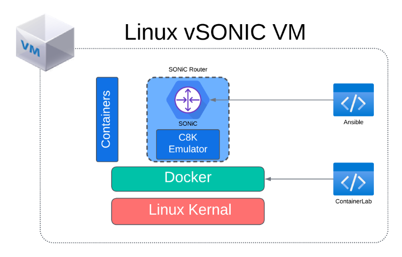
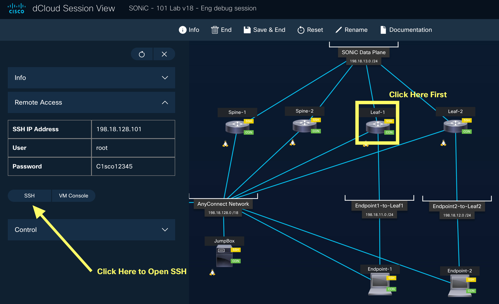

# Lab 1 Guide: SONiC Topology Setup and Validation [30 Min]

### Description: 
In Lab 1 we will explore the host-VM virtualization environment and log into the sonic-vs nodes and perform some system validation. The 4-node setup in Lab 1 will be used in all subsequent lab exercises. 

## Contents
- [Lab 1 Guide: SONiC Topology Setup and Validation \[30 Min\]](#lab-1-guide-sonic-topology-setup-and-validation-30-min)
    - [Description:](#description)
  - [Contents](#contents)
  - [Lab Objectives](#lab-objectives)
  - [Virtualization Stack](#virtualization-stack)
  - [Device Access](#device-access)
    - [Management Network Topology](#management-network-topology)
    - [User Credentials](#user-credentials)
    - [Check Build Scripts](#check-build-scripts)
    - [Connect to SONiC Routers](#connect-to-sonic-routers)
  - [End of Lab 1](#end-of-lab-1)
  
## Lab Objectives
The student upon completion of Lab 1 should have achieved the following objectives:

* Access to all devices in the lab
* Understand the Docker virtualization environment and Cisco 8000 Emulator
* Understanding of the lab topology and components
* Access the SONiC nodes   

## Virtualization Stack

The software virtualization stack used in this lab consists of several layers. At the base Linux OS level it is possible to run this lab either on bare metal or in a virtualized environment. In our dCloud lab we're running the router topology inside a host Ubuntu VM. For simplicity for students we have a single Ubuntu VM to host each SONiC instance. The scale requirements for Cisco 8000 can be found at the link [HERE}(https://www.cisco.com/c/en/us/td/docs/iosxr/cisco8000-emulator/cisco8000-hardware-emulator-datasheet.html)

To create the SONiC environment we are using Containerlab to orchestrating and managing container-based network topology. Containerlab allows for us to use a yaml definition file to spin up the Cisco 8000 hardware emulator (C8k emulator). The C8k emulator utilizes itself utilizes Docker to create a container which containes the simulated hardware environment. Within that simulated environment we boot into the SONiC operating system. 

For connectivity between virtual SONiC routers we use point-to-point VXLAN tunnels between the host-VMs. For connecitivty between the SONiC VMs and external test VM clients are using linux bridges.



## Device Access

Device access for this lab is primarly through SSH. All of the VMs within this toplogy can be accessed once you connect through Cisco AnyConnect VPN to the dCloud environment. As an alternative to AnyConnect it is possible to launch ssh sessions through the dCloud web interface. Click on the *View* button in the session section. That will launch the Topology Viewer. Within Topology Viewer you can click each node and then initiate an SSH session which will open in a new browser tab. See image below



Please see the management topology network diagram below. Table-1 below lists the IP address of each of the individual VMs for quick access to the lab. Alternatively you can access the Jumpbox VM which has access to all host-vms and the sonic router instance. 


**Table 1**
| Host name  | IP Address     | Description             |
|:-----------|:---------------|:------------------------|
| Jumpbox    | 198.18.128.100 | Hosts ansible scripts   |
| VM-Leaf-1  | 198.18.128.101 | Hosts sonic node leaf-1 |
| VM-Leaf-2  | 198.18.128.102 | Hosts sonic node leaf-1 |
| VM-Spine-1 | 198.18.128.103 | Hosts sonic node leaf-1 |
| VM-Spine-2 | 198.18.128.104 | Hosts sonic node leaf-1 |
| Endpoint-1 | 198.18.128.105 | VM used for testing     |
| Endpoint-2 | 198.18.128.105 | VM used for testing     |


### User Credentials
For the host VMs use the following credentials:
```
User: cisco, Password: cisco123
```

For all SONiC router instances you will use the same user credentials:
```
User: cisco, Password: cisco123
```

### Validate Access
Now log into each of the Ubuntu host-vms listed in Table 1 and ensure you have access to the devices.

## Check Build Scripts
This lab uses Ansible as the automation tool once the host vms have spun up. There is an Ansible script that runs that starts the Containerlab build process on each of the SONiC host-vms (vm-leaf-1, vm-leaf-2, vm-spine-1, vm-spine-2). Lets validate that the build script completed successfully.

 1. Log into the Jumpbox VM
 2. View the following file in the home directory.
    
	```
	cat /home/cisco/deploy.log
	```

  	You should see output similar to
	```
 	cisco@jumpbox:~$ cat deploy.log 
	vm-leaf-1 Router up
	vm-spine-2 Router up
	vm-spine-1 Router up
	vm-leaf-2 Router up
	```
  3. Ping each SONiC router management interface to see if the router has finished booting
     | Host name  | IP Address    |
     |:-----------|:--------------|
     | leaf-1     | 172.10.10.101 |
     | leaf-2     | 172.10.10.102 |
     | spine-1    | 172.10.10.103 |
     | spine-2    | 172.10.10.104 |

     ```
     cisco@vsonic:~$ ping leaf01
     PING leaf01 (172.10.10.101) 56(84) bytes of data.
     64 bytes from leaf01 (172.10.10.101): icmp_seq=1 ttl=64 time=0.480 ms
     64 bytes from leaf01 (172.10.10.101): icmp_seq=2 ttl=64 time=0.362 ms
     ```

> **NOTE**
>  If SONiC router does not respond to ping. Follow these directions
>
>1. SSH into the host-vm directly
>2.  Find docker instance running the Cisco 8000 emulator and lookup the container name.
>   ```
>   cisco@vm-leaf-1:~$ docker ps
>   CONTAINER ID   IMAGE                 COMMAND                  CREATED      STATUS      PORTS     NAMES
>   beffe818e4ad   c8000-clab-sonic:29   "/etc/prepEnv.sh /no…"   5 days ago   Up 5 days             clab-c8201-sonic-leaf-1
>   ```
>3. Session into the docker container
>   ```
>   cisco@vm-leaf-1:~$ docker exec -it clab-c8201-sonic-leaf-1 bash
>   root@leaf-1:/#
>   ``` 
>4. Now access the SONiC console ( cisco / cisco123 )
>   ```
>   root@leaf-1:~# telent 0 60000
>   bash: telent: command not found
>   root@leaf-1:~# telnet 0 60000
>   Trying 0.0.0.0...
>   Connected to 0.
>   Escape character is '^]'.
>
>   sonic login:
>   ```
>5. Check to see if management interface was created
>   ```
>   cisco@sonic:~$ show ip interface
>   Interface    Master    IPv4 address/mask    Admin/Oper    BGP Neighbor    Neighbor IP
>   -----------  --------  -------------------  ------------  --------------  -------------
>   docker0                240.127.1.1/24       up/down       N/A             N/A
>   eth0                   172.10.10.101/24     up/up         N/A             N/A           <--- MGMT INTERFACE
>   eth4                   192.168.123.246/24   up/up         N/A             N/A 
>   lo                     127.0.0.1/16         up/up         N/A             N/A  

### Connect to SONiC Routers

Starting from the vsonic VM log into each router instance 1-4 per the management topology diagram above. Example:
```
    ssh cisco@spine01
    ssh cisco@spine02
    ssh cisco@leaf01
    ssh cisco@leaf02
    or
    ssh cisco@172.10.10.2
    ssh cisco@172.10.10.3
    ssh cisco@172.10.10.4
    ssh cisco@172.10.10.5
```
> **NOTE**
> Password for SONiC instances is cisco123
> 
Example:
```
cisco@vsonic:~$ ssh cisco@172.10.10.2
Warning: Permanently added '172.10.10.2' (RSA) to the list of known hosts.
cisco@172.10.10.2's password: 
Linux sonic 5.10.0-18-2-amd64 #1 SMP Debian 5.10.140-1 (2022-09-02) x86_64
You are on
  ____   ___  _   _ _  ____
 / ___| / _ \| \ | (_)/ ___|
 \___ \| | | |  \| | | |
  ___) | |_| | |\  | | |___
 |____/ \___/|_| \_|_|\____|

-- Software for Open Networking in the Cloud --

Unauthorized access and/or use are prohibited.
All access and/or use are subject to monitoring.

Help:    https://sonic-net.github.io/SONiC/

Last login: Wed Aug 16 04:02:54 2023
cisco@sonic:~$ 
```

## End of Lab 1
Please proceed to [Lab 2](https://github.com/scurvy-dog/sonic-dcloud/blob/main/1-SONiC_101/lab_exercise_2.md)
