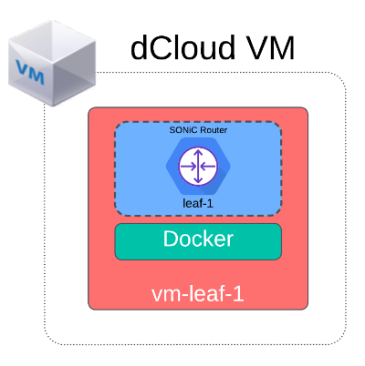

# SONiC 101 - Exercise 1: SONiC Topology Setup and Validation [30 Min]

### Description: 
In Exercise 1 we will explore the linux-host VM virtualization environment and log into the SONiC router nodes and perform some system validation. The 4-node setup in Lab 1 will be used in all subsequent lab exercises. 

## Contents
- [SONiC 101 - Exercise 1: SONiC Topology Setup and Validation \[30 Min\]](#sonic-101---exercise-1-sonic-topology-setup-and-validation-30-min)
    - [Description:](#description)
  - [Contents](#contents)
  - [Lab Objectives](#lab-objectives)
  - [Virtualization Stack](#virtualization-stack)
  - [Device Access](#device-access)
    - [User Credentials](#user-credentials)
    - [Validate Access](#validate-access)
    - [Git repository location](#git-repository-location)
  - [Check Build Scripts](#check-build-scripts)
    - [Connect to SONiC Routers](#connect-to-sonic-routers)
  - [End of Lab 1](#end-of-lab-1)
  
## Lab Objectives
The student upon completion of Lab 1 should have achieved the following objectives:

* Access to all devices in the lab
* Understand the Docker virtualization environment and Cisco 8000 Emulator
* Understanding of the lab topology and components
* Access the SONiC nodes and verified their operational state   

## Virtualization Stack

The software virtualization stack used in this lab consists of several layers. At the base Linux OS level it is possible to run this lab either on bare metal or in a virtualized environment. In our dCloud lab we're running the 4-router topology inside 4 host Ubuntu VMs.  The scale requirements for Cisco 8000 can be found at the link [HERE}(https://www.cisco.com/c/en/us/td/docs/iosxr/cisco8000-emulator/cisco8000-hardware-emulator-datasheet.html)

To create the SONiC environment we are using Containerlab (https://containerlab.dev/) to orchestrate and manage our container-based network topology. Containerlab allows us to use a yaml definition file to spin up a Dockerized Cisco 8000 hardware emulator (C8k emulator). The C8k emulator itself utilizes qemu/kvm to create a nested virtual machine which contains the simulated hardware environment. Within that simulated environment VXR will boot the SONiC operating system. 

For connectivity between virtual SONiC routers we use point-to-point VXLAN tunnels between the host-VMs. For connecitivty between the SONiC VMs and external test VM clients are using linux bridges.


## Device Access

Device access for this lab is primarly through SSH. All of the VMs within this toplogy can be accessed once you connect through Cisco AnyConnect VPN to the dCloud environment. As an alternative to AnyConnect it is possible to launch ssh sessions through the dCloud web interface. Click on the *View* button in the session section. That will launch the Topology Viewer. Within Topology Viewer you can click each node and then initiate an SSH session which will open in a new browser tab. See image below


Please see the management topology network diagram below. Table-1 below lists the IP address of each of the individual VMs for quick access to the lab. Alternatively you can access the Jumpbox VM which has access to all host-vms and the sonic router instance. 


> [!NOTE]
> In dCloud we have a a relationship of one Ubuntu VM hosting one SONiC router container.
>


**Table 1**
| Host name  | IP Address     | Description               |
|:-----------|:---------------|:--------------------------|
| jumpbox    | 198.18.128.100 | Hosts ansible scripts     |
| linux-host-1  | 198.18.128.101 | Hosts sonic router sonic-rtr-leaf-1 |
| linux-host-2  | 198.18.128.102 | Hosts sonic router sonic-rtr-leaf-1 |
| linux-host-3 | 198.18.128.103 | Hosts sonic router sonic-rtr-leaf-1 |
| linux-host-4 | 198.18.128.104 | Hosts sonic router sonic-rtr-leaf-1 |
| endpoint-1 | 198.18.128.105 | VM used for testing       |
| endpoint-2 | 198.18.128.106 | VM used for testing       |
| sonic-rtr-leaf-1     | 172.10.10.101  | SONiC Router sonic-rtr-leaf-1       |
| sonic-rtr-leaf-2     | 172.10.10.102  | SONiC Router sonic-rtr-leaf-2       |
| sonic-rtr-spine-1    | 172.10.10.103  | SONiC Router sonic-rtr-spine-1      |
| sonic-rtr-spine-2    | 172.10.10.104  | SONiC Router sonic-rtr-spine-2      |

### User Credentials
For the host VMs use the following credentials:
```
User: cisco, Password: cisco123
```

For all SONiC router instances you will use the same user credentials:
```
User: cisco, Password: cisco123
```

### Validate Access
Now log into each of the Ubuntu host-vms listed in Table 1 and ensure you have access to the devices.

### Git repository location
All documentation and scripts used in this lab are cloned to the cisco user home directory. To start look for the README.md file.
```
/home/cisco/sonic-dcloud/1-SONiC_101
```

## Check Build Scripts
This lab uses Ansible as the automation tool once the host vms have spun up. There is an Ansible script that runs at dCloud Lab startup that kicks off the Containerlab build process on each of the SONiC host-vms (linux-host-1, linux-host-2, linux-host-3, linux-host-4). The Containerlab/SONiC build script takes about 12-15 minutes to run after dCloud startup, so grab a cup of coffee and check in around 15 minutes after dCloud says your lab is up. 

To validate that the build script completed successfully.

 1. Log into the Jumpbox VM
 2. View the following file in the home directory.
    
    ```
    cat /home/cisco/deploy.log
    ```
    
    You may also monitor more detailed ansible output tracking the build process using tail -f on the detailed logfile:
    ```
    tail -f /home/cisco/deploy.log.detail
    ```

    Once the  VXR/SONiC build process completes the summary deploy.log file should look something like this:

    ```
    cisco@jumpbox:~$ cat deploy.log
    2023-10-14 10:12:34 PDT: Start Container Lab Deploy Script
    2023-10-14 10:12:34 PDT: Expect to wait 10+ minutes as containers are built.
    2023-10-14 10:12:37 PDT: SONiC Router sonic-rtr-leaf-1 build start 
    2023-10-14 10:12:38 PDT: SONiC Router sonic-rtr-spine-2 build start 
    2023-10-14 10:12:38 PDT: SONiC Router sonic-rtr-spine-1 build start 
    2023-10-14 10:12:37 PDT: SONiC Router sonic-rtr-leaf-2 build start 
    2023-10-14 10:12:37 PDT: SONiC Router clab-c8101-sonic-leaf-2 2023-10-14T17:19:13.907514268Z Router up
    2023-10-14 10:12:37 PDT: SONiC Router clab-c8101-sonic-leaf-1 2023-10-14T17:18:50.082588335Z Router up
    2023-10-14 10:12:38 PDT: SONiC Router clab-c8101-sonic-spine-1 2023-10-14T17:19:47.451838674Z Router up
    2023-10-14 10:12:39 PDT: SONiC Router clab-c8101-sonic-spine-2 2023-10-14T17:19:48.751145006Z Router up
    2023-10-14 10:27:55 PDT: SONiC Router Health Check Script
    2023-10-14 10:27:55 PDT: SONiC Router sonic-rtr-leaf-1: Health Check Passed
    2023-10-14 10:27:55 PDT: SONiC Router sonic-rtr-leaf-2: Health Check Passed
    2023-10-14 10:27:55 PDT: SONiC Router sonic-rtr-spine-1: Health Check Passed
    2023-10-14 10:27:55 PDT: SONiC Router sonic-rtr-spine-2: Health Check Passed

    ```
    If all 4 SONiC nodes have come up and passed health check you may proceed to [Connect to SONiC Routers](#connect-to-sonic-routers)

    > [!IMPORTANT]
    In some cases a SONiC node fails to successfully build. When this happens the deploy playbook triggers a rebuild process on the failed node. The rebuild will take another 10-12 minutes, so you may begin exercise 1 while also monitoring the rebuilding node in the deploy logs.

    Example deploy.log output showing three routers successfully launched, and one failure, which is queued for rebuild:
    ```
    cisco@jumpbox:~$ cat deploy.log
    2023-10-16 12:26:55 PDT: Start Containerlab Deploy Script
    2023-10-16 12:26:55 PDT: Expect to wait 10+ minutes as VXR scripts build out SONiC routers
    2023-10-16 12:26:58 PDT: SONiC Router sonic-rtr-leaf-1 build start 
    2023-10-16 12:26:57 PDT: SONiC Router sonic-rtr-spine-2 build start 
    2023-10-16 12:26:57 PDT: SONiC Router sonic-rtr-spine-1 build start 
    2023-10-16 12:27:03 PDT: SONiC Router sonic-rtr-leaf-2 build start 
    2023-10-16 12:26:57 PDT: SONiC Router sonic-rtr-spine-1 2023-10-16T19:35:28.701491348Z Router failed to come up   <-------
    2023-10-16 12:26:58 PDT: SONiC Router sonic-rtr-leaf-1 2023-10-16T19:33:55.027861619Z Router up
    2023-10-16 12:27:03 PDT: SONiC Router sonic-rtr-leaf-2 2023-10-16T19:34:28.829917638Z Router up
    2023-10-16 12:26:57 PDT: SONiC Router sonic-rtr-spine-2 2023-10-16T19:34:27.286082895Z Router up
    2023-10-16 12:35:51 PDT: Running SONiC Router Health Check Script
    2023-10-16 12:35:51 PDT: SONiC Router sonic-rtr-leaf-1: Health Check Passed
    2023-10-16 12:35:51 PDT: SONiC Router sonic-rtr-leaf-2: Health Check Passed
    2023-10-16 12:35:51 PDT: SONiC Router sonic-rtr-spine-1: Failed. Queued for rebuild.      <-------
    2023-10-16 12:35:51 PDT: SONiC Router sonic-rtr-spine-2: Health Check Passed.
    2023-10-16 12:36:01 PDT: SONiC Router sonic-rtr-spine-1 rebuild started. 
    2023-10-16 12:36:01 PDT: sonic-rtr-spine-1 2023-10-16T19:43:15.485235137Z Router up     <-------
    2023-10-16 12:36:01 PDT: sonic-rtr-spine-1 rebuild script complete
    2023-10-16 12:36:01 PDT: Deploy script complete. Check SONiC 101 troubleshooting.md instructions if any nodes have not come back with 'Router up' message
    ```

 Note the last message in deploy.log. If any routers fail to come up after the rebuild we'll need to manually launch the build script. Instructions to do so are here:

> [HERE](https://github.com/scurvy-dog/sonic-dcloud/blob/main/1-SONiC_101/troubleshooting.md)

If all routers came up, then we may proceed to ping and connectivity checks:
For convenience we've put shortened hostname entries for the SONiC nodes in the /etc/hosts file on the jumpbox and linux host VMs:

  1. Ping each SONiC router management interface to see if the router has finished booting
     | Host name  | IP Address    |
     |:-----------|:--------------|
     | leaf-1     | 172.10.10.101 |
     | leaf-2     | 172.10.10.102 |
     | spine-1    | 172.10.10.103 |
     | spine-2    | 172.10.10.104 |

     ```
    cisco@jumpbox:~$ ping leaf-1
    PING leaf-1 (172.10.10.101) 56(84) bytes of data.
    64 bytes from leaf-1 (172.10.10.101): icmp_seq=1 ttl=64 time=0.947 ms
    64 bytes from leaf-1 (172.10.10.101): icmp_seq=2 ttl=64 time=0.386 ms
     ```

> [!NOTE]
>  If SONiC router does not respond to ping. Follow the "Can't Ping" instructions in [Can't Ping Mgt](troubleshooting.md/#cant-ping-sonic-managment-interface)
>

### Connect to SONiC Routers

Starting from the vsonic VM log into each router instance 1-4 per the management topology diagram above. Example:
```
ssh cisco@leaf-1
ssh cisco@leaf-2
ssh cisco@spine-1
ssh cisco@spine-2

or
ssh cisco@172.10.10.101
ssh cisco@172.10.10.102
ssh cisco@172.10.10.103
ssh cisco@172.10.10.104
```
> **NOTE**
> Password for SONiC instances is cisco123
> 
Example:
```
cisco@jumpbox:~$ ssh cisco@leaf-1
cisco@leaf-1's password: 
Linux sonic 5.10.0-18-2-amd64 #1 SMP Debian 5.10.140-1 (2022-09-02) x86_64
You are on
  ____   ___  _   _ _  ____
 / ___| / _ \| \ | (_)/ ___|
 \___ \| | | |  \| | | |
  ___) | |_| | |\  | | |___
 |____/ \___/|_| \_|_|\____|

-- Software for Open Networking in the Cloud --

Unauthorized access and/or use are prohibited.
All access and/or use are subject to monitoring.

Help:    https://sonic-net.github.io/SONiC/

Last login: Mon Oct 16 03:59:53 2023 from 172.10.10.1
cisco@sonic:~$ 

## End of Lab 1
Please proceed to [Lab 2](https://github.com/scurvy-dog/sonic-dcloud/blob/main/1-SONiC_101/lab_exercise_2.md)
