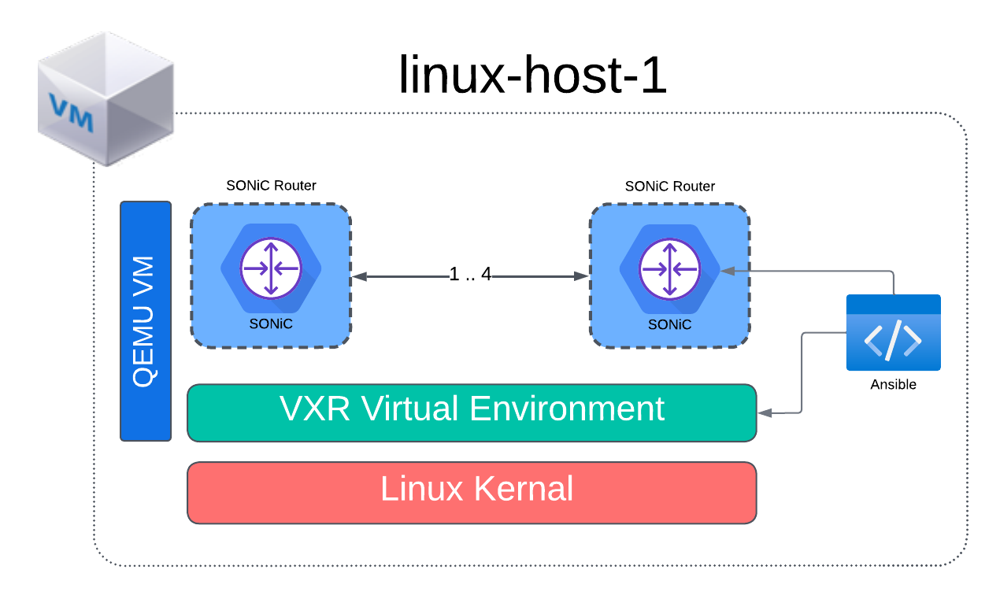
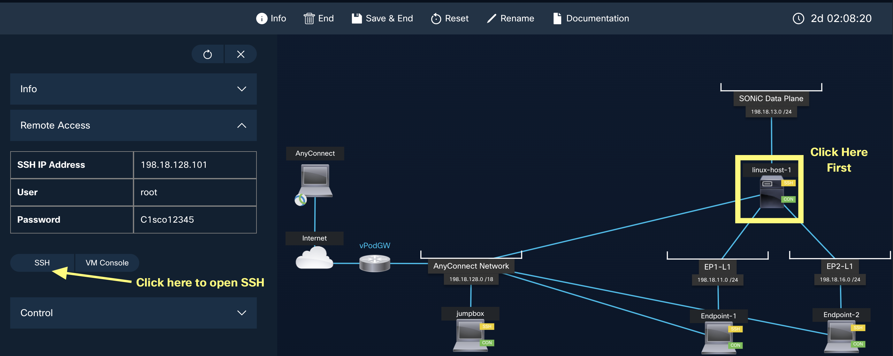

# SONiC 101 - Exercise 1: SONiC Topology Setup and Validation [30 Min]

### Description: 
In Exercise 1 we will explore the linux-host VM virtualization environment and log into the SONiC router nodes and perform some system validation. The 4-node setup in Lab 1 will be used in all subsequent lab exercises. 

## Contents
- [SONiC 101 - Exercise 1: SONiC Topology Setup and Validation \[30 Min\]](#sonic-101---exercise-1-sonic-topology-setup-and-validation-30-min)
    - [Description:](#description)
  - [Contents](#contents)
  - [Lab Objectives](#lab-objectives)
  - [Virtualization Stack](#virtualization-stack)
  - [Device Access](#device-access)
    - [User Credentials](#user-credentials)
    - [Validate Access](#validate-access)
      - [*Note: to log into the sonic nodes you will first need to ssh into the linux-host-1 VM*](#note-to-log-into-the-sonic-nodes-you-will-first-need-to-ssh-into-the-linux-host-1-vm)
    - [Git repository location](#git-repository-location)
  - [Check Build Scripts](#check-build-scripts)
    - [Connect to SONiC Routers](#connect-to-sonic-routers)
  - [End of Lab 1](#end-of-lab-1)
  
## Lab Objectives
The student upon completion of Lab 1 should have achieved the following objectives:

* Access to all devices in the lab
* Understand the Docker virtualization environment and Cisco 8000 Emulator
* Understanding of the lab topology and components
* Access the SONiC nodes and verified their operational state   

## Virtualization Stack

The software virtualization stack used in this lab consists of several layers. At the base Linux OS level it is possible to run this lab either on bare metal or in a virtualized environment. In our dCloud lab we're running the 4-router topology inside one host Ubuntu VM named *linux-host-1*.  The scale requirements for Cisco 8000 emumlator can be found at the link [HERE](https://www.cisco.com/c/en/us/td/docs/iosxr/cisco8000-emulator/cisco8000-hardware-emulator-datasheet.html)

To create the SONiC environment we are using Ansible to orchestrate and manage our container-based network topology. The Python based Cisco VXR tool allows us to use a yaml definition file to spin up a Cisco 8000 hardware emulator (C8k emulator). The C8k emulator itself utilizes QEMU/kvm to create a nested virtual machine which contains the simulated hardware router. Within that simulated environment we will boot ONIE to boot the SONiC operating system. 

For connectivity between virtual SONiC routers we use bridges built by VXR Emulator. For connecitivty between the SONiC VMs and external test VM clients are using linux bridges.



## Device Access

Device access for this lab is primarly through SSH. All of the VMs within this toplogy can be accessed once you connect through Cisco AnyConnect VPN to the dCloud environment. As an alternative to AnyConnect it is possible to launch ssh sessions through the dCloud web interface. Click on the *View* button in the session section. That will launch the Topology Viewer. Within Topology Viewer you can click each node and then initiate an SSH session which will open in a new browser tab. See image below:



Please see the management topology network diagram below. Table-1 below lists the IP address of each of the individual VMs for quick access to the lab. Alternatively you can access the Jumpbox VM which has access to all host-vms and the sonic router instance. 


**Table 1**
| Host name  | IP Address     | Description               |
|:-----------|:---------------|:--------------------------|
| linux-host-1  | 198.18.128.101 | Hosts sonic router sonic-rtr-leaf-1 |
| endpoint-1 | 198.18.128.105 | VM used for testing       |
| endpoint-2 | 198.18.128.106 | VM used for testing       |
| sonic-rtr-leaf-1     | 192.168.122.101  | SONiC Router sonic-rtr-leaf-1       |
| sonic-rtr-leaf-2     | 192.168.122.102  | SONiC Router sonic-rtr-leaf-2       |
| sonic-rtr-spine-1    | 192.168.122.103  | SONiC Router sonic-rtr-spine-1      |
| sonic-rtr-spine-2    | 192.168.122.104  | SONiC Router sonic-rtr-spine-2      |

### User Credentials

For all VM and SONiC router instances you will use the same user credentials:
```
User: cisco, Password: cisco123
```

### Validate Access
Now log into each of the nodes listed in Table 1 and ensure you have access to the devices.

  #### *Note: to log into the sonic nodes you will first need to ssh into the linux-host-1 VM*

### Git repository location
All documentation and scripts used in this lab are cloned to the cisco user home directory. To start look for the README.md file.
```
/home/cisco/sonic-dcloud/1-SONiC_101
```

## Check Build Scripts
SONiC is fundamentally a Debian Linux OS running a containerized routing application suite. And this Linux-centric nature makes tools such as Ansible a natural fit for deployment and configuration operations. In our environment an Ansible script executes at dCloud Lab startup and kicks off the VXR/SONiC build process on the host VM. The deploy script takes about 10 minutes to run after dCloud startup, so grab a cup of coffee and check in around 10-12 minutes after dCloud says your lab is up. 

To validate that the deploy script completed successfully.

 1. Log into the linux-host-1 VM (ssh cisco@198.18.128.101)
 2. View the following file in the home directory.
    
    ```
    cat /home/cisco/deploy.log
    ```
    
    You may also monitor more detailed ansible output tracking the build process using tail -f on the detailed logfile:
    ```
    tail -f /home/cisco/ansible.log
    ```

    Once the  VXR/SONiC build process completes the summary *deploy.log* file should contain output from pinging SONiC node management interfaces and 4 sets of interfaces, example:

    ```
    2023-11-16 20:58:07 UTC: SONiC Router sonic-rtr-spine-2   Interface                Lanes    Speed    MTU    FEC    Alias    Vlan    Oper    Admin        
        Type    Asym PFC
    -----------  -------------------  -------  -----  -----  -------  ------  ------  -------  ---------------  ----------
    Ethernet0  1296,1297,1298,1299     100G   9100    N/A     etp1  routed      up       up  QSFP28 or later         N/A
    Ethernet4  1300,1301,1302,1303     100G   9100    N/A     etp2  routed      up       up  QSFP28 or later         N/A
    Ethernet8  1288,1289,1290,1291     100G   9100    N/A     etp3  routed      up       up  QSFP28 or later         N/A
    Ethernet12  1292,1293,1294,1295     100G   9100    N/A     etp4  routed      up       up  QSFP28 or later         N/A
    Ethernet16  1280,1281,1282,1283     100G   9100    N/A     etp5  routed      up       up  QSFP28 or later         N/A
    Ethernet20  1284,1285,1286,1287     100G   9100    N/A     etp6  routed      up       up  QSFP28 or later         N/A
    Ethernet24  1032,1033,1034,1035     100G   9100    N/A     etp7  routed      up       up  QSFP28 or later         N/A
    Ethernet28  1036,1037,1038,1039     100G   9100    N/A     etp8  routed      up       up  QSFP28 or later         N/A
    Ethernet32  1024,1025,1026,1027     100G   9100    N/A     etp9  routed      up       up  QSFP28 or later         N/A
    Ethernet36  1028,1029,1030,1031     100G   9100    N/A    etp10  routed      up       up  QSFP28 or later         N/A
    Ethernet40      772,773,774,775     100G   9100    N/A    etp11  routed      up       up  QSFP28 or later         N/A
    Ethernet44      768,769,770,771     100G   9100    N/A    etp12  routed      up       up  QSFP28 or later         N/A
    Ethernet48      780,781,782,783     100G   9100    N/A    etp13  routed      up       up  QSFP28 or later         N/A
    Ethernet52      776,777,778,779     100G   9100    N/A    etp14  routed      up       up  QSFP28 or later         N/A
    Ethernet56      528,529,530,531     100G   9100    N/A    etp15  routed      up       up  QSFP28 or later         N/A
    Ethernet60      532,533,534,535     100G   9100    N/A    etp16  routed      up       up  QSFP28 or later         N/A
    Ethernet64      520,521,522,523     100G   9100    N/A    etp17  routed      up       up  QSFP28 or later         N/A
    Ethernet68      524,525,526,527     100G   9100    N/A    etp18  routed      up       up  QSFP28 or later         N/A
    Ethernet72      512,513,514,515     100G   9100    N/A    etp19  routed      up       up  QSFP28 or later         N/A
    Ethernet76      516,517,518,519     100G   9100    N/A    etp20  routed      up       up  QSFP28 or later         N/A
    Ethernet80      272,273,274,275     100G   9100    N/A    etp21  routed      up       up  QSFP28 or later         N/A
    Ethernet84      276,277,278,279     100G   9100    N/A    etp22  routed      up       up  QSFP28 or later         N/A
    Ethernet88      264,265,266,267     100G   9100    N/A    etp23  routed      up       up  QSFP28 or later         N/A
    Ethernet92      268,269,270,271     100G   9100    N/A    etp24  routed      up       up  QSFP28 or later         N/A
    Ethernet96      256,257,258,259     100G   9100    N/A    etp25  routed      up       up  QSFP28 or later         N/A
    Ethernet100      260,261,262,263     100G   9100    N/A    etp26  routed      up       up  QSFP28 or later         N/A
    Ethernet104          16,17,18,19     100G   9100    N/A    etp27  routed      up       up  QSFP28 or later         N/A
    Ethernet108          20,21,22,23     100G   9100    N/A    etp28  routed      up       up  QSFP28 or later         N/A
    Ethernet112            8,9,10,11     100G   9100    N/A    etp29  routed      up       up  QSFP28 or later         N/A
    Ethernet116          12,13,14,15     100G   9100    N/A    etp30  routed      up       up  QSFP28 or later         N/A
    Ethernet120              0,1,2,3     100G   9100    N/A    etp31  routed      up       up  QSFP28 or later         N/A
    Ethernet124              4,5,6,7     100G   9100    N/A    etp32  routed      up       up  QSFP28 or later         N/A

    ```
    If all 4 SONiC nodes have come up with interfaces detected you may proceed to [Connect to SONiC Routers](#connect-to-sonic-routers)

    > [!IMPORTANT]
    In rare instances a SONiC node or nodes might:
    
    1. Fail to ping or acquire the correct management IP (this generally isn't very bad)
    2. Fail to successfully build and detect its interfaces (this is more of a bummer)
    
    If the deploy log indicates either ping failure or empty interface status output please proceed to the:

    > [Troubleshooting Guide](https://github.com/scurvy-dog/sonic-dcloud/blob/main/1-SONiC_101/troubleshooting.md)


If all routers came up and mgt interfaces are pinging, then we may proceed to:

### Connect to SONiC Routers

Starting from the vsonic VM log into each router instance 1-4 per the management topology diagram above. Example:
```
ssh cisco@leaf-1
ssh cisco@leaf-2
ssh cisco@spine-1
ssh cisco@spine-2

or
ssh cisco@192.168.122.101
ssh cisco@192.168.122.102
ssh cisco@192.168.122.103
ssh cisco@192.168.122.104
```
> **NOTE**
> Password for SONiC instances is cisco123
> 
Example:
```
cisco@linux-host-1:~$ ssh leaf-1
The authenticity of host 'leaf-1 (192.168.122.101)' can't be established.
RSA key fingerprint is SHA256:FW4ZBS7zybVdb+oH4x+xj5vf7Fb+ClJyBZoMCb6uI6k.
This key is not known by any other names
Are you sure you want to continue connecting (yes/no/[fingerprint])? yes
Warning: Permanently added 'leaf-1' (RSA) to the list of known hosts.
cisco@leaf-1's password: 
Linux sonic-rtr-leaf-1 4.19.0-12-2-amd64 #1 SMP Debian 4.19.152-1 (2020-10-18) x86_64
You are on
  ____   ___  _   _ _  ____
 / ___| / _ \| \ | (_)/ ___|
 \___ \| | | |  \| | | |
  ___) | |_| | |\  | | |___
 |____/ \___/|_| \_|_|\____|

-- Software for Open Networking in the Cloud --

Unauthorized access and/or use are prohibited.
All access and/or use are subject to monitoring.

Help:    https://sonic-net.github.io/SONiC/

Last login: Fri Nov 17 23:01:54 2023
cisco@sonic-rtr-leaf-1:~$ 
```

## End of Lab 1
Please proceed to [Lab 2](https://github.com/scurvy-dog/sonic-dcloud/blob/main/1-SONiC_101/lab_exercise_2.md)
