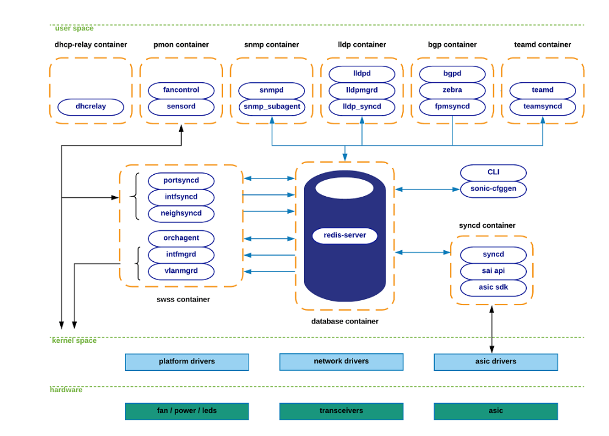
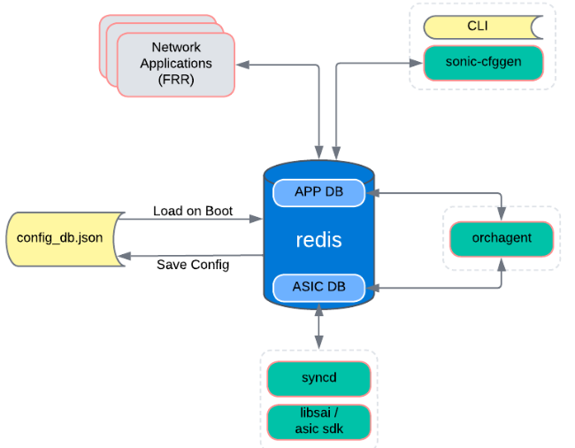
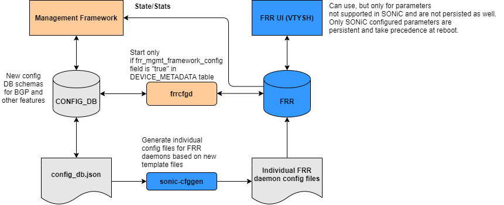
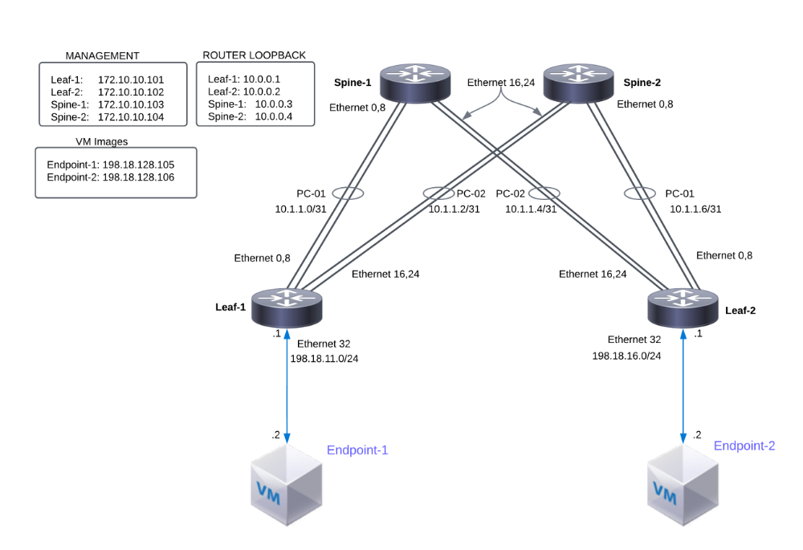

# SONiC 101 - Exercise 2: Explore SONiC NOS [40 Min]

### Description: 
In Exercise 2 the student will explore the SONiC network operating system, its components, services, config management, and CLI. Second, they will run an Ansible script to apply global and interface configurations to the nodes in our topology. And finally we will validate connectivity between SONiC nodes and from SONiC nodes to our endpoint VMs.

## Contents
- [Exercise 2: Explore SONiC NOS \[40 Min\]](#lab-exercise-2-explore-sonic-nos-40-min)
  - [Lab Objectives](#lab-objectives)
  - [Tour of SONiC](#tour-of-sonic)
    - [SONiC Software Architecture](#sonic-software-architecture)
    - [Managing Configurations](#managing-configurations)
      - [Loading Configuration from JSON file](#loading-configuration-from-json-file)
      - [Reloading Configuration](#reloading-configuration)
      - [Saving Configuration to a File for Persistence](#saving-configuration-to-a-file-for-persistence)
      - [Edit Configuration Through CLI](#edit-configuration-through-cli)
      - [FRR Configuration Management](#frr-configuration-management)
  - [Ansible Automation](#ansible-automation)
  - [Configure Leaf-1 with SONiC CLI](#configure-leaf-1-with-sonic-cli)
  - [Network Connectivity](#network-connectivity)
  - [End of Lab Exercise 2](#end-of-lab-exercise-2)
  
## Lab Objectives
The student upon completion of Lab 2 should have achieved the following objectives:

* Understanding of the software components within SONiC
* Ability to see status of various services
* Configuration management structure
* How to load configuration through Ansible
* How to apply manual configuration through the SONiC CLI
* Valadiate end to end topology 

## Tour of SONiC
### SONiC Software Architecture
SONiC leverages a microservices-style architecture comprised of various modules running as Docker containers. The containers interact and communicate with each other through the Switch State Service (swss) container. The infrastructure also relies on the use of a redis-database engine: a key-value database to provide a language independent interface, a method for data persistence, replication and multi-process communication among all SONiC subsystems.

Further reading: https://developer.cisco.com/docs/sonic/#!sonic-architecture
    
By relying on the publisher/subscriber messaging paradigm offered by the redis-engine infrastructure, applications can subscribe only to the data-views that they require, and avoid implementation details that are irrelevant to their functionality.

SONiC places each module in independent docker containers to keep high cohesion among semantically related components, while reducing coupling between disjointed ones. Each of these components are written to be entirely independent of the platform-specific details required to interact with lower-layer abstractions. See diagram below for high level architecture view.



As of today, SONiC breaks its main functional components into the following docker containers:

| Docker Container Name| Description                                                      |
|:---------------------|:-----------------------------------------------------------------|
| BGP                  | Runs Quagga or FRR. These stacks include other routing protocols |
| Database             | Hosts the redis-database engine|
| DHCP_Relay           | DHCP-Relay agent |
| LLDP                 | Hosts LLDP. Includes 3 process *llpd*, *LLDP-syncd*, *LLDPmgr* |
| MGMT-Framework       | North Bound Interfaces (NBIs) for  managing configuration and status|
| PMON                 | Runs *sensord* daemon used to log and alert sensor data |
| RADV                 | Hosts *radv* daemon and handles IPv6 router solicitations / router advertisements |
| SNMP                 | Hosts SNMP feature. *SNMPD* and *SNMP-Agent* |
| SWSS                 | Collection of tools to allow communication among all SONiC modules |
| SYNCD                | synchronization of the switch's network state with the switch's actual hardware/ASIC |
| TeamD                | Runs open-source implementation of LAG protocol |
| Telemetry            | Contains implementation for the sonic system telemetry service |

You can see the list of the running containers with SONiC by running the below command once logged into a SONiC device.
```
docker ps
```
```
cisco@leaf-1:~$ docker ps
CONTAINER ID   IMAGE                                COMMAND                  CREATED       STATUS       PORTS     NAMES
d3dec180edf1   docker-sonic-telemetry:latest        "/usr/local/bin/supe…"   7 hours ago   Up 3 hours             telemetry
73408f13ba26   docker-snmp:latest                   "/usr/local/bin/supe…"   7 hours ago   Up 3 hours             snmp
dd0fcc119898   docker-platform-monitor:latest       "/usr/bin/docker_ini…"   7 hours ago   Up 3 hours             pmon
b5bfcb99ed76   docker-sonic-mgmt-framework:latest   "/usr/local/bin/supe…"   7 hours ago   Up 3 hours             mgmt-framework
a897bd933245   docker-lldp:latest                   "/usr/bin/docker-lld…"   7 hours ago   Up 3 hours             lldp
48663b8df8f6   docker-router-advertiser:latest      "/usr/bin/docker-ini…"   7 hours ago   Up 3 hours             radv
ce538630853c   docker-gbsyncd-vs:latest             "/usr/local/bin/supe…"   7 hours ago   Up 3 hours             gbsyncd
1206abe29dc5   docker-fpm-frr:latest                "/usr/bin/docker_ini…"   7 hours ago   Up 3 hours             bgp
b702fb2043ee   docker-syncd-vs:latest               "/usr/local/bin/supe…"   7 hours ago   Up 3 hours             syncd
6132ac862c62   docker-teamd:latest                  "/usr/local/bin/supe…"   7 hours ago   Up 3 hours             teamd
d3cb89acd257   docker-orchagent:latest              "/usr/bin/docker-ini…"   7 hours ago   Up 3 hours             swss
a0355d7eb56b   docker-eventd:latest                 "/usr/local/bin/supe…"   7 hours ago   Up 3 hours             eventd
c002ab9b311f   docker-database:latest               "/usr/local/bin/dock…"   7 hours ago   Up 3 hours             database
```
> **Note**
>For greater detail on container services see this link [HERE](https://github.com/sonic-net/SONiC/wiki/Architecture)

### Managing Configurations
Configuration state in SONiC is saved in two separate locations. For persistant configuration between reloads configuration files are used. The main configuration is found at */etc/sonic/config_db.json*. The second configuration file in this lab is for the FRR routing stack and it's configuratin is found at */etc/sonic/frr/bgpd.conf*. However, BGP configuration when saved from the redis database is pushed to config_db and as such is the preferred location if you were to edit the *"saved configuration"*.  

When the router boots it loads the configuration from these two files into the redis database. The redis database is the running configuration of the router where the various services read or write state information into the redis database.



#### Loading configuration from JSON file

The command *config load* is used to load a configuration following the JSON schema. This command loads the configuration from the input file (if user specifies this optional filename, it will use that input file. Otherwise, it will use the default */etc/sonic/config_db.json* file as the input file) into CONFIG_DB. The configuration present in the input file is applied on top of the already running configuration. This command does not flush the config DB before loading the new configuration (i.e., If the configuration present in the input file is same as the current running configuration, nothing happens) If the config present in the input file is not present in running configuration, it will be added. If the config present in the input file differs (when key matches) from that of the running configuration, it will be modified as per the new values for those keys.

- Usage:
```
config load [-y|--yes] [<filename>]
```
- Example:
```
cisco@spine-1:~$ sudo config load
Load config from the file /etc/sonic/config_db.json? [y/N]: y
Running command: /usr/local/bin/sonic-cfggen -j /etc/sonic/config_db.json --write-to-db
```

#### Reloading configuration

This command is used to clear current configuration and import new configurationn from the input file or from */etc/sonic/config_db.json*. This command shall stop all services before clearing the configuration and it then restarts those services.

The command *config reload* restarts various services/containers running in the device and it takes some time to complete the command.
> **NOTE**
> If the user had logged in using SSH, users might get disconnected depending upon the new management IP address. Users need to reconnect their SSH sessions.

- Usage:
```
config reload [-y|--yes] [-l|--load-sysinfo] [<filename>] [-n|--no-service-restart] [-f|--force]
```
- Example:
```
cisco@spine-1~$ sudo config reload
Clear current config and reload config from the file /etc/sonic/config_db.json? [y/N]: y
Running command: systemctl stop dhcp_relay
Running command: systemctl stop swss
Running command: systemctl stop snmp
Warning: Stopping snmp.service, but it can still be activated by:
  snmp.timer
Running command: systemctl stop lldp
Running command: systemctl stop pmon
Running command: systemctl stop bgp
Running command: systemctl stop teamd
Running command: /usr/local/bin/sonic-cfggen -H -k Force10-Z9100-C32 --write-to-db
Running command: /usr/local/bin/sonic-cfggen -j /etc/sonic/config_db.json --write-to-db
Running command: systemctl restart hostname-config
Running command: systemctl restart interfaces-config
Timeout, server 10.11.162.42 not responding.
```

#### Saving Configuration to a File for Persistence

The command *config save* is used to save the config DB configuration into the user-specified filename or into the default /etc/sonic/config_db.json. This saves the current redis database CONFIG_DB int the configuration specified by the user. This is analogous in Cisco IOS as the command *copy run start*. 

Saved files can be transferred to remote machines for debugging. If users wants to load the configuration from this new file at any point of time, they can use "config load" command and provide this newly generated file as input. 

- Usage:
```
config save [-y|--yes] [<filename>]
```
- Example (Save configuration to /etc/sonic/config_db.json):

```
cisco@spine-1:~$ sudo config save -y
```

- Example (Save configuration to a specified file):
```
cisco@spine-1:~$ sudo config save -y /etc/sonic/config2.json
```

#### Edit Configuration Through CLI

Configuration management is also possible through the SONiC CLI. From the SONiC command prompt enter *config* and the command syntax needed. 
```
cisco@leaf-1:~$ config -?
Usage: config [OPTIONS] COMMAND [ARGS]...

  SONiC command line - 'config' command
```

#### FRR Configuration Management

FRR is an open-source routing stack that supports multiple protocols. In this lab we will focus on BGP routing protocol. 

First FRR stores it's configuration in a separate file located at */etc/sonic/frr/bgpd.conf*. There are different methods to manage the configuration for FRR.





**View Startup FRR BGP Configuration**
```
show startupconfiguration bgp
```

**View Running FRR Configuration**
```
 show run bgp
```
**Save Running FRR Configuration to File**
For direct FRR configuration you use the *vtysh* command which drops you into the FRR command shell. This shell has a more of a router CLI command feel with show commands, config terminal, and config save commands. The below command drops you into FRR and tells FRR to copy the running config and save it to file.

```
vtysh
copy run start
```

## Ansible Automation
In this lab we are going to use an Ansible playbook to create the baseline configuration on three of the four SONiC nodes in our topology. That means we are going to replace the */etc/sonic/config_db.json* which will contain global parameters an link setup with IP addresses.

There are several relevant files for our ansible playbook

| Name                        | Location                                         | Notes                               |
|:----------------------------|:-------------------------------------------------|:------------------------------------|
| lab_exercise_2-playbook.yml | ~/sonic-dcloud/1-SONiC_101/ansible/              | Ansible playbook file               |
| hosts                       | ~/sonic-dcloud/1-SONiC_101/ansible/              | Contains device list and IPs        |
| config_db.json              | ~/sonic-dcloud/1-SONiC_101/ansible/files/{host}/ | Global configuration file for lab-2 |

1. Log into host-vm *jumpbox*
   ```
   ssh cisco@198.18.128.100
   ```
2. Change to the ansible directory
   ```
   cd ansible
   ```
3. Run the lab_exercise_2 Ansible playbook to copy global and interface configurations to leaf-2, spine-1, and spine-2 routers. Once copied the playbook will then load and save configurations. The playbook will load a subset of configuration to leaf-1.

   ```
   ansible-playbook -i hosts lab_exercise_2-playbook.yml -e "ansible_user=cisco ansible_ssh_pass=cisco123 ansible_sudo_pass=cisco123" -vv
   ```
   
   > [!IMPORTANT]
   > Ansible playbook configured router *spine-1*, *spine-2*, and *leaf-2*. You will manually configure router *leaf-1* later in this lab.
   >

   You should expect a large amount of output from ansible but, at the end of logs look for the following output
   ```
   PLAY RECAP
   ***************************************************************************************************************************************
   leaf-1               : ok=7    changed=1    unreachable=0    failed=0    skipped=0    rescued=0    ignored=0
   leaf-2               : ok=7    changed=1    unreachable=0    failed=0    skipped=0    rescued=0    ignored=0
   spine-1              : ok=7    changed=1    unreachable=0    failed=0    skipped=0    rescued=0    ignored=0
   spine-2              : ok=7    changed=1    unreachable=0    failed=0    skipped=0    rescued=0    ignored=0
   ```

## Configure Leaf-1 with SONiC CLI

1. Log into SONiC router *leaf-1*
   ```
   ssh cisco@172.10.10.101
   ssh cisco@leaf-1
   ```
2. Configure *Loopback0* and add IPv4 and IPv6
   ```
   sudo config interface ip add Loopback0 10.0.0.1/32
   sudo config interface ip add Loopback0 fc00:0:1::1/128
   ```
3. Configure Ethernet interface from *leaf-1* to *endpoint01*
   ```
   sudo config interface ip add Ethernet32 198.18.11.1/24
   ```
4. Create Port Channels to *spine-1* and *spine-2*
   ```
   sudo config portchannel add PortChannel1
   sudo config portchannel add PortChannel2
   ```
5.  Configure Port Channel interface members
    ```
    sudo config portchannel member add PortChannel1 Ethernet0
    sudo config portchannel member add PortChannel1 Ethernet4
    sudo config portchannel member add PortChannel2 Ethernet8
    sudo config portchannel member add PortChannel2 Ethernet12
    ```
6. Configure Port Channel IPs
   ```
   sudo config interface ip add PortChannel1 10.1.1.0/31
   sudo config interface ip add PortChannel2 10.1.1.2/31
   sudo config interface ip add PortChannel1 fc00:0:ffff::/127
   sudo config interface ip add PortChannel2 fc00:0:ffff::2/127
   ```

7. Save configuration
   ```
   sudo config save
   ```
   
8. Exit the sonic node and ssh back in to see the hostname change in effect

## Network Connectivity
Next we'll validate that all of the links between nodes in the topology have been successfully brought up and IP addresses were assigned correctly.

To check on interface status and connectivity follow these steps on each router in the topology

**INTERFACES**
- Log into each router referencing the IP and login credentials in lab_exercise_1
- Check the interface status. The abbreviated output command for this would be. All interfaces should be in an UP/UP status
  
   ```
   show interface status
   or
   show interface description
   ```

   ```
   cisco@sonic:~$ show interface description
   Interface    Oper    Admin    Alias    Description
   -----------  ------  -------  -------  -------------
   Ethernet0      up       up     etp0
   Ethernet4      up       up     etp1
   Ethernet8      up       up     etp2
   Ethernet12     up       up     etp3
   Ethernet16     up       up     etp4
   Ethernet20     up       up     etp5
   Ethernet24     up       up     etp6
   Ethernet28     up       up     etp7
   Ethernet32     up       up     etp8
   ....
   ```
- Show LLDP adjacency information to see interface remote neighbors

  ```
  show lldp table
  ```

  ```
  cisco@leaf-1:~$  show lldp table
  Capability codes: (R) Router, (B) Bridge, (O) Other
  LocalPort    RemoteDevice    RemotePortID    Capability    RemotePortDescr
  -----------  --------------  --------------  ------------  -----------------
  Ethernet0    spine-1         etp0            BR            Ethernet0
  Ethernet4    spine-1         etp1            BR            Ethernet4
  Ethernet8    spine-2         etp2            BR            Ethernet8
  Ethernet12   spine-2         etp3            BR            Ethernet12
  --------------------------------------------------
  Total entries displayed:  4
  cisco@leaf-1:~$ 
  ```

**PORT CHANNELS**
- Example below is for *leaf-1* and  shows the relevant section of the running configuration. Port Channel configuration in the running configuration has three parts.
- 1. Port channel definitions
  2. Port channel IP information
  3. Port channel member links

  
  ```json
  "PORTCHANNEL": {                 <------ Port Channel Definition
        "PortChannel1": {
            "admin_status": "up",
            "lacp_key": "auto",
            "min_links": "1",
            "mtu": "9100"
        },
        "PortChannel2": {
            "admin_status": "up",
            "lacp_key": "auto",
            "min_links": "1",
            "mtu": "9100"
        }
    },
    "PORTCHANNEL_INTERFACE": {     <------ Port Channel IP Information
        "PortChannel1": {},
        "PortChannel1|10.1.1.0/31": {},
        "PortChannel1|fc00:0:ffff::/127": {},
        "PortChannel2": {},
        "PortChannel2|10.1.1.2/31": {},
        "PortChannel2|fc00:0:ffff::2/127": {}
    },
    "PORTCHANNEL_MEMBER": {         <------ Port Channel Member Links
        "PortChannel1|Ethernet0": {},
        "PortChannel1|Ethernet4": {},
        "PortChannel2|Ethernet8": {},
        "PortChannel2|Ethernet12": {}
  ```

- Check that the port-channels were created and look at the member links
   ```
   show interface portchannel
   ```
   
   ```
   cisco@leaf-1:~$ show interface portchannel
   Flags: A - active, I - inactive, Up - up, Dw - Down, N/A - not available,
          S - selected, D - deselected, * - not synced
   No.  Team Dev      Protocol     Ports
   -----  ------------  -----------  ---------------------------
      1  PortChannel1  LACP(A)(Up)  Ethernet0(S) Ethernet4(S)   <------ See LADP status Active
      2  PortChannel2  LACP(A)(Up)  Ethernet8(S) Ethernet12(S)
   cisco@leaf-1:~$     
   ```

**IP Adjaceny**
-    View the configured IP address as listed in the below diagram.



- Verify that IPs are configured on the SONiC routers
  ```
  show ip interfaces
  ```
  ```
  cisco@leaf-1:~$ show ip interfaces
  Interface     Master    IPv4 address/mask    Admin/Oper    BGP Neighbor    Neighbor IP
  ------------  --------  -------------------  ------------  --------------  -------------
  Ethernet32              198.18.11.1/24       up/up         N/A             N/A
  Loopback0               10.0.0.1/32          up/up         N/A             N/A
  PortChannel1            10.1.1.0/31          up/up         N/A             N/A
  PortChannel2            10.1.1.2/31          up/up         N/A             N/A
  docker0                 240.127.1.1/24       up/down       N/A             N/A
  eth0                    172.10.10.201/24     up/up         N/A             N/A
  eth4                    192.168.123.188/24   up/up         N/A             N/A
  lo                      127.0.0.1/16         up/up         N/A             N/A
  cisco@leaf-1:~$ 
  ```

- Ping the adjacent IP for the routed linnks
  ```
  cisco@leaf-1:~$ ping 10.1.1.1
  PING 10.1.1.1 (10.1.1.1) 56(84) bytes of data.
  64 bytes from 10.1.1.1: icmp_seq=1 ttl=64 time=280 ms
  64 bytes from 10.1.1.1: icmp_seq=2 ttl=64 time=144 ms
  ^C
  --- 10.1.1.1 ping statistics ---
  2 packets transmitted, 2 received, 0% packet loss, time 1001ms
  rtt min/avg/max/mdev = 143.566/211.937/280.309/68.371 ms
  cisco@leaf-1:~$ ping 10.1.1.3
  PING 10.1.1.3 (10.1.1.3) 56(84) bytes of data.
  64 bytes from 10.1.1.3: icmp_seq=1 ttl=64 time=100 ms
  64 bytes from 10.1.1.3: icmp_seq=2 ttl=64 time=249 ms
  ^C
  --- 10.1.1.3 ping statistics ---
  3 packets transmitted, 3 received, 0% packet loss, time 2003ms
  rtt min/avg/max/mdev = 100.222/156.657/249.050/65.864 ms
  cisco@leaf-1:~$ 
  ```
**Congratulations you have successfully completed Lab Exercise 2. We are now ready to configure routing protocols.**

## End of Lab Exercise 2
Please proceed to [Lab 3](https://github.com/scurvy-dog/sonic-dcloud/blob/main/1-SONiC_101/lab_exercise_3.md)
