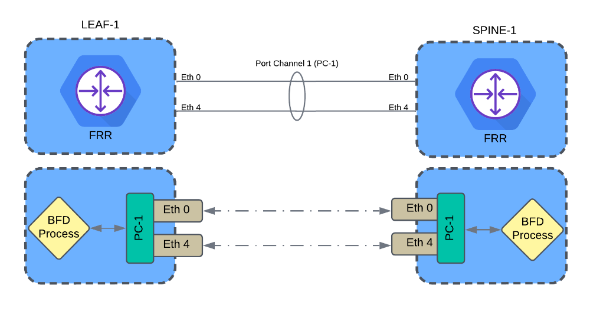

# SONiC 101 - Exercise 4: Bi-directional Forward Detection (BFD) [20 Min]

### Description: 
In Lab Exercise 4 the student will explore BFD as its currently implemented in SONiC. As we've seen, SONiC has FRR running in its "bgp" docker container. By default the FRR/BGP container runs zebra, staticd, and bgpd daemons, as well as a couple other processes. To enable additional FRR daemons such as ISIS or BFD we need to 'exec' into the container and enable the daemon. Once enabled, we can then vtysh into FRR and apply our BFD configuration.

> [!IMPORTANT]
> BFD is a feature in development within SONiC. In this lab exercise we'll manually enable the BFD daemon and configure BFD, however, the daemon won't persist across router reloads or restarts of the bgp container

## Contents
- [Exercise 4: Bi-directional Forward Detection BFD \[20 Min\]]
    - [Description:](#description)
  - [Lab Objectives](#lab-objectives)
  - [BGP Configuration](#bfd-configuration)
  - [End of Lab 4](#end-of-lab-4)
  
## Lab Objectives
The student upon completion of Lab Exercise 5 should have achieved the following objectives:

* Understand the relationship of FRR process and the SONiC BGP container
* BFD Configuratin in FRR
* Validate BFD sessions

## BFD Configuration

For the purposes of this lab we will enable BFD between *leaf-1* and *spine-1* on the port-channel interface connecting the two routers. See diagram below.


You will be manually configuring the BFD configurations on *leaf-1* and *spine-1*. 

1. Next we'll manually enable/configure BFD on leaf-1

2.  SSH to leaf-1 and docker exec into its BGP container 

	```
	docker exec -it bgp bash
	```

3.  cd into /usr/lib/frr and enable the bfdd process to run in the background:

	```
	cd /usr/lib/frr
	./bfdd &
	```

	Example:
	```
	root@spine01:/# cd /usr/lib/frr
	root@spine01:/usr/lib/frr# ./bfdd &
	[1] 370
	root@spine01:/usr/lib/frr# 
	```

4.  You can validate the daemon is running with the systemd service command:
   
	```
	service frr status
	```
	Example output:
	```
	root@spine-2:/# service frr status
	Status of watchfrr: running.
	Status of zebra: running.
	Status of bgpd: running.
	Status of staticd: running.
	Status of bfdd: running.
	```

### configure BFD in FRR
1. start bfd daemon
   
2. configure BFD on spine-1
```
vtysh
conf t
```
```
bfd
 peer 10.1.1.0
 peer 10.1.1.6
 exit
 !
router bgp 65000
 neighbor 10.1.1.0 bfd
 neighbor 10.1.1.6 bfd
```

1. configure BFD on leaf-1
```
vtysh
conf t
```
```
bfd
 peer 10.1.1.1
 peer 10.1.1.3
 exit
 !
router bgp 65001
 neighbor 10.1.1.1 bfd
 neighbor 10.1.1.3 bfd
```

1. config BFD on spine-2
```
bfd
 peer 10.1.1.2
 peer 10.1.1.4
 exit
 !
router bgp 65000
 neighbor 10.1.1.2 bfd
 neighbor 10.1.1.4 bfd
```

1. config BFD on leaf-2
```
bfd
 peer 10.1.1.5
 peer 10.1.1.7
 exit
 !
router bgp 65002
 neighbor 10.1.1.5 bfd
 neighbor 10.1.1.7 bfd
```

1. Verify BFD sessions:

```
leaf-1# show bfd peer 10.1.1.1
BFD Peer:
	peer 10.1.1.1 vrf default
		ID: 2663753925
		Remote ID: 1540583716
		Active mode
		Status: up            <---- We are looking for this
		Uptime: 41 second(s)
		Diagnostics: ok
		Remote diagnostics: ok
		Peer Type: configured
		RTT min/avg/max: 0/0/0 usec
		Local timers:
			Detect-multiplier: 3
			Receive interval: 300ms
			Transmission interval: 300ms
			Echo receive interval: 50ms
			Echo transmission interval: disabled
		Remote timers:
			Detect-multiplier: 3
			Receive interval: 300ms
			Transmission interval: 300ms
			Echo receive interval: 50ms

leaf-1# 
```

## End of Lab 4
Please proceed to [Lab 5](https://github.com/scurvy-dog/sonic-dcloud/blob/main/1-SONiC_101/lab_exercise_5.md)
