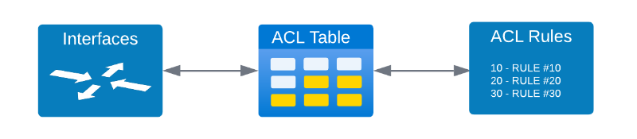

# SONiC 101 - Exercise 4: ACL Overview and Config [35 Min]


### Description: 
In Exercise 4 the student will explore how SONiC utilizes ACLs in data-plane and control plane application. An overview of where and how SONiC applies ACLs will be provided and configuration examples.

## Contents
- [Exercise 4: ACL Overview and Config \[30 Min\]](#lab-exercise-4-acl-overview-and-config-35-min)
    - [Description:](#description)
  - [Contents](#contents)
  - [Lab Objectives](#lab-objectives)
  - [SONiC ACL Architecture](#sonic-acl-architecture)
  - [ACL Tables](#acl-tables)
    - [ACL Table Parameters](#acl-table-parameters)
    - [ACL Table Syntax](#acl-table-syntax)
    - [ACL Table Add](#acl-tables-add)
    - [ACL Table Delete](#acl-table-delete)
  - [ACL Rules](#acl-rules)
    - [ACL Rule parameters](#acl-rule-parameters)
    - [ACL Rule Syntax](#acl-rule-syntax)
    - [ACL Rule Add](#acl-rule-add)
    - [ACL Rule Delete](#acl-rule-delete)
  - [ACL Examples](#acl-examples)
    - [Example 1 - Match ICMP](#example-1---match-ip-protocol-and-drop-icmp)
    - [Example 2 - Match TCP Port](#example-2---match-tcp-port-and-drop) 
  - [End of Lab 4](#end-of-lab-4)
  
## Lab Objectives
The student upon completion of Lab Exercise 4 should have achieved the following objectives:

* Understand types of ACLs SONiC Supports
* Basic ACL syntax construction
* Ability to apply ACLs in SONiC

## SONiC ACL Architecture
The core of ACLs in SONiC is the ACL Table which links interface(s) with rule sets and defines the direction of the policy enforcement. See the diagram below to see the relationship.



ACLs can be grouped into three general categories:
    1. Data-plane ACLs applied against physical interfaces
    2. Control plane ACLs
    3. Mirror ACLs for capturing and replicating traffic
In this lab we will focus on the first type - Data-plane ACLs.

## ACL Tables
In this lab we are focusing specifically on data-plane ACLs. The purpose of data-plane ACL tables is to link a set of rules that can be applied to data-plane traffic to a group of defined interfaces. 

ACL tables can be created or deleted using either CLI or through a JSON definition which is loaded into the running config. We will show both options in this lab. 

### ACL Table Parameters
Data-plane ACL Tables have mandatory and optional defined fields as listed in the below table.

| Parameters | CLI Flag | Mandatory | Details                                          |
|:-----------|:--------:|:---------:|:-------------------------------------------------|
| table name | none     | X         | The name of the ACL table to create.             |
| table type | none     | X         | Type of ACL table to create. *See table above*   |
| description| -d       |           | Table description. Defaults to table name        |
| ports      | -p       |           | Binds table to physical port,portchannel, VLAN   |
| stage      | -s       |           | Valid options are ingress (default) or egress    |


**Table Type Field Definitions**
| Type                | Description                       | Ingress | Egress  | 
|:--------------------|:----------------------------------|:-------:|:-------:|
| L3                  | Match on IPv4 ACL                 | X       | X       |
| L3V6                | Match on IPv6 ACL                 | X       | X       |
| L3V4V6              | Match on IPv4 and v6 combined ACL | X       | X       |
| MIRROR              | Match on IPv4 ACL to mirror flow  | X       | X       |
| MIRRORV6            | Match on IPv6 ACL to mirror flow  | X       | X       |
| MIRROR_DSCP         | Match on DSCP ACL to mirror flow  | X       | X       |
| PFCWD               | Research                          | X       | X       |
| MLAG                | Research                          | X       | X       |
| MUX                 | Research                          | X       | X       |
| DROP                | Research                          | X       | X       |
| CTRLPLANE           | Research                          | X       | X       |
| DTEL_FLOW_WATCHLIST | Research                          | X       | X       |

### ACL Table Syntax

In this example set of code we want to set the following parameters through CLI or JSON.
- Name the ACL Table: ICMP_DROP
- Traffic Type Affected: IPv4 Layer 3 packets
- Interface Bindings: Ethernet 32
- Traffic Direction: Ingress
    
#### ACL Table Add
**Adding ACL Table with CLI**
```
cisco@leaf-2:~$ sudo config acl add table --help
Usage: config acl add table [OPTIONS] <table_name> <table_type>
  Add ACL table

Options:
  -d, --description TEXT
  -p, --ports TEXT
  -s, --stage [ingress|egress]
```
We will now add in an ACL table using the above parameters using the CLI below.
  ```
  sudo config acl add table ICMP_DROP L3 -p Ethernet32 -d "BLock ICMP traffic from Endpoint2" -s ingress
  ```
  ```
  cisco@leaf-2:~$ sudo acl-loader show table
  Name       Type    Binding     Description                        Stage    Status
  ---------  ------  ----------  ---------------------------------  -------  --------
  ICMP_DROP  L3      Ethernet32  BLock ICMP traffic from Endpoint2  ingress  Active
  ```

**Adding ACL Table through JSON**
To utilize JSON to create an ACL it is a two step process. First you must construct a valid JSON syntax file and store that on the SONiC router itself. The second step is to use the config load command to add the table into the running configuration. See steps below.

**Example of ACL Table JSON**
Save this json acl table definition to a file on the SONiC device as acl_table_icmp.json

```
{
"ACL_TABLE": {
            "ICMP_DROP": {
                    "policy_desc" : "Block IMCP traffic from endpoint 2",
                    "type" : "L3",
                    "stage": "ingress",
                    "ports" : [
                        "Ethernet32"
                    ] 
                    }
        }
}
```
**Loading the ACL table JSON file into the running config**
```
sudo config load acl_table_icmp.json
```

### ACL Table Delete
Through CLI you an leverage the *sudo config acl remove* command as seen below

```
sudo config acl remove table ICMP_DROP
```

## ACL Rules
ACL Rules contain the detail step by step policy that is implemented by the tables. ACL Rule structure will identify which ACL Table they should be joined to. ACL Rules can only be defined using JSON and have no CLI option. We will show a basic ACL Rule used to block ICMP traffic coming from Endpoint-2 to *Loopback 0* on Leaf-2

### ACL Rule Parameters
ACL rule sets have a much larger parameter set than tables due to the complex nature of the ACL match option combinations. There are over 30 plus parameters list in the table below. In this lab we will use 2-3 as examples.

- For reference on Ethernet Header see this link [HERE](https://en.wikipedia.org/wiki/Ethernet_frame)
- For reference on IPv4 Packet Header see this link [HERE](https://en.wikipedia.org/wiki/Internet_Protocol_version_4#Header)
- For reference on IPv6 Packet Header see this link [HERE](https://en.wikipedia.org/wiki/IPv6#IPv6_packets)
- For reference on ICMP Packet Header see this link [HERE](https://en.wikipedia.org/wiki/Ping_(networking_utility)#ICMP_packet)
- For referenec on VXLAN Packet Header see this link [HERE](https://learningnetwork.cisco.com/s/blogs/a0D3i000005YebJEAS/introduction-to-vxlan)

**Match Table Parameters**

| Type               | Description                                | Notes                                          | 
|:-------------------|:-------------------------------------------|:-----------------------------------------------|
| IN_PORTS           | Match Ingress Port                         |                                                |
| OUT_PORTS          | Match Egress Port                          |                                                |
| SRC_IP             | Match Source IPv4 Address                  | A valid IPv4 subnet in format IP/Mask          |
| DST_IP             | Match Destination IPv4 Address             | A valid IPv4 subnet in format IP/Mask          |
| SRC_IPV6           | Match Source IPv6 Address                  | A valid IPv6 subnet in format IP/Mask          |
| DST_IPV6           | Match Destination IPv6 Address             | A valid IPv6 subnet in format IP/Mask          |
| L4_SRC_PORT        | Match Source Layer 4 Port                  | Decimal integer [0..65535]                     |
| L4_DST_PORT        | Match Destination Layer 4 Port             | Decimal integer [0..65535]                     |
| L4_SRC_PORT_RANGE  | Match Source Layer 4 Port Range            | Two dash separated decimal integers [0..65535] |
| L4_DST_PORT_RANGE  | Match Destination Layer 4 Port Range       | Two dash separated decimal integers [0..65535] |
| ETHER_TYPE         | Match Ethernet Type Field                  |                                                |
| VLAN_ID            | Match VLAN ID                              |                                                |
| IP_PROTOCOL        | Match IP Protocol Number                   | Hexadecimal unsigned integer [0..FF]           |
| NEXT_HEADER        | Match IPv6 Next Header Field               |                                                |
| TCP_FLAGS          | Match TCP Flags Field                      | Hexadecimal unsigned integer [0..FF]           |
| IP_TYPE            | Match IPv4 Options Type Field              | String of one type of: "IPv4"/"NON_IPv4"/"ARP" |
| ETHER_TYPE         | Match Ethernet Type Field                  |                                                |
| DSCP               | Match IPv4 Header DSCP Field               | DSCP (6b)                                      |
| TC                 | Match IPv6 Header Traffic Class Field      | DSCP(6b) + ECN(2b)                             |
| ICMP_TYPE          | Match ICMPv4 ICMP Type Field               |                                                |
| ICMP_CODE          | Match ICMPv4 ICMP Code Field               |                                                |
| ICMPV6_TYPE        | Match ICMPv6 Type Field                    |                                                |
| ICMPV6_CODE        | Match ICMPv6 Options Field                 |                                                |
| TUNNEL_VNI         | Match VXLAN VNID Field                     | VNI (24b)                                      |
| INNER_ETHER_TYPE   | Match Inner Header Ethernet Type Field     |                                                |
| INNER_IP_PROTOCOL  | Match Inner Header IP Protocol Number      |                                                |
| INNER_L4_SRC_PORT  | Match Inner Header Source Layer 4 Port     |                                                |
| INNER_L4_DST_PORT  | Match Inner Header Destination Layer 4 Port|                                                |
| BTH_OPCODE         |                                            |                                                |
| AETH_SYNDROME      |                                            |                                                |


### ACL Rule Syntax
ACL rules are defined using the JSON syntax for purposes of importing into the runnging configuration (redis database). The syntax follows a strict heirarchy of objects and then defining key:value pairs. 

The top level of the heirarchy is defined by the "ACL_RULE" object. Within the objects that data set are individual rules.
Individual rules follows the below syntax
```
    "<ACL TABLE NAME>|<ACL RULE NAME>":{
        "<KEY VALUE>": "<KEY VALUE>",
        "<KEY VALUE>": "<KEY VALUE>"
        }
```
Each ACL rule for data-plane ACL rule requires two key values: *PACKET_ACTION* and *PRIORITY*. 
The remaining <key>:<value> pairs would be matching conditions found in the above table labled *Match Table Parameters*.

If the ACL Table type is *L3* or *L3V6* then the ACL rule *PACKET_ACTION* valid options are {FORWARD | DROP}

The *PRIORITY* value is processed by **highest numerical value first**. So in the below rule set RULE_20 with *PRIORITY 20* will be processed before RULE_10 *PRIORITY 10*.

### ACL Rule Add
**Example JSON file that should be saved as acl_rule_icmp.json** 

```
{
    "ACL_RULE": {
        "ICMP_INGRESS|RULE_10": {
            "PACKET_ACTION": "FORWARD",
            "PRIORITY": "10",
            "SRC_IP": "198.18.12.1/32"
        },
        "ICMP_INGRESS|RULE_20": {
            "PACKET_ACTION": "DROP",
            "PRIORITY": "20",
            "SRC_IP": "10.0.0.2/32"
        }
    }
}
```

**Loading the ACL rule JSON file into the running config**
```
sudo config load acl_rule_icmp.json
```

### ACL Rule Delete
> **NOTE**
> SONiC does not support the removal of ACLs through CLI. The below json will remove all ACL rules

The below json will remove **ALL** ACL rule sets in the running configuration. Save the JSON into a file called acl-wipe.json
  
```
{
    "acl": {
        "acl-sets": {
            "acl-set": {
            }
        }
    }
}
```

Apply the command using the below.
```
sudo config acl update full acl-wipe.json
```

## ACL Examples
Below are two basic ACLs to show how to apply and check ACL effectivness 

### Example 1 - Match IP Protocol and DROP ICMP
In this example we will block ICMP traffic sourced from *endpoint-1* to SONiC router *leaf-1* *loopback 0* interface.
We will need to apply the ACL to the *Ethernet 32* interface of *leaf-1*.
Lets create an ACL table that we will link to the interface.

1. SSH to *endpoint-1*
2. Ping *leaf-1 loopback 0* interface
   ```
   ping 10.0.0.1
   ```
   ```
   You should see response as below:
   cisco@endpoint-1:~$ ping 10.0.0.1
   PING 10.0.0.1 (10.0.0.1) 56(84) bytes of data.
   64 bytes from 10.0.0.1: icmp_seq=1 ttl=64 time=4.42 ms
   64 bytes from 10.0.0.1: icmp_seq=2 ttl=64 time=3.70 ms
   64 bytes from 10.0.0.1: icmp_seq=3 ttl=64 time=10.5 ms
   ```
   
3. Login to SONiC router *leaf-1*
4. In the home directory create a json definition file for the ACL table we will create.
   ```
   nano eth32_acl_table.json
   ```
5. Paste in the following code and save and exit.
   ```
   {
   "ACL_TABLE": {
            "EP1_DROP": {
                    "policy_desc" : "DROP selective traffic from endpoint-1",
                    "type" : "L3",
                    "stage": "ingress",
                    "ports" : [
                        "Ethernet32"
                    ] 
                    }
           }
   }
   ```
6. Load the json definition file into the running config
   ```
   sudo config load eth32_acl_table.json
   ```
7. Verify the ACL table was installed.
   ```
   show acl table
   ```
   ```
   cisco@leaf-1:~$ show acl table
   Name       Type    Binding     Description                         Stage    Status
   ---------  ------  ----------  ----------------------------------  -------  --------
   EP1_DROP   L3      Ethernet32  Block IMCP traffic from endpoint 1  ingress  Active
   ```
8. Check that there are no ACL Rules applied
   ```
   show acl rule
   ```
   ```
    cisco@leaf-1:~$ show acl rule
    Table    Rule    Priority    Action    Match    Status
    -------  ------  ----------  --------  -------  --------
    ```
    
9. In the home directory lets create a json definition file for the ACL Rule Set
    ```
    nano acl_ep1_ingress.json
    ```
10. Paste in the following code and save and exit.
    ```
    {
      "ACL_RULE": {
          "EP1_DROP|RULE_10": {
              "PACKET_ACTION": "FORWARD",
              "PRIORITY": "10",
              "SRC_IP": "198.18.11.2/32"
          },
          "EP1_DROP|RULE_20": {
              "PACKET_ACTION": "DROP",
              "PRIORITY": "20",
              "SRC_IP": "198.18.11.2/32",
              "IP_PROTOCOL":1
          }
      }
    }    
    ```

11. Verify the ACL rule set was installed
    ```
    cisco@leaf-1:~$ sudo config load acl_ep1_ingress.json
    Load config from the file(s) acl_ep1_ingress.json ? [y/N]: y
    Running command: /usr/local/bin/sonic-cfggen -j acl_ep1_ingress.json --write-to-db
    
    cisco@leaf-1:~$ show acl rule
    Table      Rule     Priority    Action    Match                   Status
    ---------  -------  ----------  --------  ----------------------  --------
    EP1_DROP   RULE_20  20          FORWARD   SRC_IP: 198.18.11.2/32  Active
    EP1_DROP   RULE_10  10          DROP      IP_PROTOCOL: 1          Active  
                                              SRC_IP: 198.18.11.2/32
    ```
    
### Example 2 - MATCH TCP Port and DROP
In this example we will block iPerf3 traffic sourced from *endpoint-1* (client) to  *endpoint-2* (server). iPerf3 will utilize TPC port 5201 for the data flow.
Utilizing the same table *EP1_DROP* we will update the ACL rule set on interface *Ethernet 32* on *leaf-1*

1. SSH to *endpoint-2*
2. Start the iPerf3 server process
   ```
   iperf3 -s
   ```
3. SSH to *endpoint-1* and run a control test of iPerf3 to *endpoint-2*
   ```
   iperf3 -c 198.18.12.2
   ```
   You should see output like the below:
   ```
   cisco@endpoint-1:~$ iperf3 -c 198.18.12.2
   Connecting to host 198.18.12.2, port 5201
   [  5] local 198.18.11.2 port 59272 connected to 198.18.12.2 port 5201
   [ ID] Interval           Transfer     Bitrate         Retr  Cwnd
   [  5]   0.00-1.00   sec  16.4 MBytes   137 Mbits/sec   24    144 KBytes
   [  5]   1.00-2.00   sec  24.0 MBytes   201 Mbits/sec    6    232 KBytes
   [  5]   2.00-3.00   sec  28.9 MBytes   242 Mbits/sec    9    304 KBytes
   [  5]   3.00-4.00   sec  30.1 MBytes   253 Mbits/sec   56    359 KBytes
   [  5]   4.00-5.00   sec  25.9 MBytes   217 Mbits/sec   13    403 KBytes
   [  5]   5.00-6.00   sec  22.9 MBytes   192 Mbits/sec   29    437 KBytes
   [  5]   6.00-7.00   sec  26.1 MBytes   219 Mbits/sec   12    474 KBytes
   [  5]   7.00-8.00   sec  24.4 MBytes   205 Mbits/sec    0    512 KBytes
   [  5]   8.00-9.00   sec  23.2 MBytes   194 Mbits/sec    2    542 KBytes
   [  5]   9.00-10.00  sec  25.2 MBytes   212 Mbits/sec   33    573 KBytes
   - - - - - - - - - - - - - - - - - - - - - - - - -
   [ ID] Interval           Transfer     Bitrate         Retr
   [  5]   0.00-10.00  sec   247 MBytes   207 Mbits/sec  184             sender
   [  5]   0.00-10.05  sec   245 MBytes   204 Mbits/sec                  receiver

   iperf Done.
   ```
4. SSH into *leaf-1*. Now lets update the ACL rule set applied to ACL table *EP1_DROP*.
5. In the home directory create a json definition file for the ACL rule for iPerf3
   ```
   nano iperf3_rule_update.json
   ```
6. Paste in the following code and save and exit.
   ```
   {
    "ACL_RULE": {
        "EP1_DROP|RULE_30": {
            "PACKET_ACTION": "DROP",
            "PRIORITY": "30",
            "L4_DST_PORT": "5201"
        }
     }
   }
   ```
7. Load the json definition file into the running config
   ```
   sudo config load iperf3_rule_update.json
   ```
8. Verify the ACL table was installed.
   ```
   cisco@leaf-1:~$ show acl rule
   Table     Rule     Priority    Action    Match                   Status
   --------  -------  ----------  --------  ----------------------  --------
   EP1_DROP  RULE_30  30          DROP      L4_DST_PORT: 5201       Active
   EP1_DROP  RULE_20  20          DROP      IP_PROTOCOL: 1          Active
                                            SRC_IP: 198.18.11.2/32
   EP1_DROP  RULE_10  10          FORWARD   SRC_IP: 198.18.11.2/32  Active
   ```
9. Now switch back to *endpoint-1* and rerun the iPerf3 test.
   ```
   iperf3 -c 198.18.12.2
   ```
   You should see output like the below showing the iPerf3 test hangs
   ```
   cisco@endpoint-1:~$ iperf3 -c 198.18.12.2

   ```

## End of Lab 4
Please proceed to [Lab 5](https://github.com/scurvy-dog/sonic-dcloud/edit/main/1-SONiC_101/lab_exercise_5.md)
