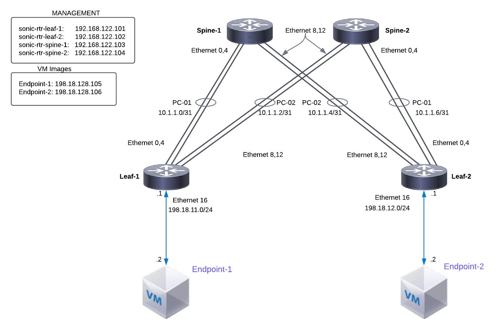

# Welcome to the SONiC on Cisco 8000 Emulator Lab

### Description: This repository contains lab guide, router configs, setup scripts, and other code for the SONIC-101 lab

SONiC is an open source network operating system based on Linux that runs on switches/routers from multiple vendors and ASICs. SONiC offers a full-suite of network functionality, like BGP, that has been production-hardened in the data centers of some of the largest cloud-service providers. That said, of this writing (October 2023) SONiC may not be the best choice for all network operators. One of the purposes of this lab series is to give network engineers and operators hands on exposure to SONiC so they may get a sense for what's available today, and what challenges they might face should they pursue a real SONiC deployment.

Though it is easy to run SONiC in a virtualized lab environment, this lab brings the ability to run SONiC on a platform that emulates the Cisco 8000 hardware. This allows us to test data-plane features such as ACLs, hardware counters, and debug tools. 

The lab software stack is built off the SONiC master build with Cisco specific platform drivers for the Cisco 8000 hardware.

## Contents
* dCloud Session Overview [LINK](#dcloud-session-overview)
* Repository Overview [LINK](#git-repository-overview)
* Lab Topology [LINK](#lab-topology)
* Remote Access [LINK](#remote-access)
* Exercise 1 - Launching Topology [LINK](lab_exercise_1.md)
* Exercise 2 - Explore SONiC OS [LINK](lab_exercise_2.md)
* Exercise 3 - BGP Configuration [LINK](lab_exercise_3.md)
* Exercise 4 - BFD Configuration [LINK](lab_exercise_4.md)
* Exercise 5 - ACL Configuration [LINK](lab_exercise_5.md)

## dCloud Session Overview
Typically when one launches a dCloud session the scheduler will set a start time at the next quarter-hour mark (top of the hour, 15 after, etc.). In the case of the SONiC 8000 Emulator lab an Ansible 'deploy' playbook is launched at lab startup. This playbook will launch the dockerized VXR instances that build a SONiC router on each of the Linux host VMs. The SONiC build process takes 10-15 minutes to run and your lab won't truly be ready until it completes. The deploy playbook outputs log entries to two logfiles in /home/cisco on the jumpbox:

deploy.log - summary info
deploy.log.detail - more detailed Ansible output

You can monitor the status of the topology deployment by running 'tail -f' on the logfiles:
```
tail -f deploy.log
tail -f deploy.log.detail
```

## Github Repository Overview
Each of the labs is designed to be completed in the order presented. Within each lab directory you should see several files of importance:

| Directory/File Name      | Description                                                   |
|:-------------------------|:--------------------------------------------------------------|
| ansible                  | Contains all the ansible configurations and playbooks         |
| appendix                 | Reference files                                               |
| topo-drawings            | Reference diagram location                                    |
| lab_exercise_X.md        | User guide for each lab exercise                              |


## Lab Topology

This lab is based on a simulated DC fabric design of four dockerized SONiC routers each running inside a Linux host VM. In addition there is the jumpbox VM, from which we'll trigger Ansible playbooks. Finally there are two client VMs named Endpoint-1 and Endpoint-2, from which we'll source test traffic. All VMs are running Ubuntu 22.04.



## Remote Access
We primarily use SSH to interact with all VMs and SONiC routers, however, dCloud does offer SSH through its UI.
*Note*: username and password for all elements in the lab is cisco/cisco123

### Virtual Machine Access Table
| VM Name        | Description                    | Device Type | Access Type |   IP Address    |
|:---------------|:-------------------------------|:-----------:|:-----------:|:---------------:|
| jumpbox        | File Staging, Ansible Playbooks| VM          | SSH         | 198.18.128.100  |
| linux-host-1   | C8k Emulator + SONiC routers   | VM          | SSH         | 198.18.128.101  |
| linux-host-2   | C8k Emulator + SONiC routers   | VM          | SSH         | 198.18.128.102  |
| linux-host-3   | C8k Emulator + SONiC routers   | VM          | SSH         | 198.18.128.103  |
| linux-host-4   | C8k Emulator + SONiC routers   | VM          | SSH         | 198.18.128.104  |
| endpoint-1     | Ubuntu client                  | VM          | SSH         | 198.18.128.105  |
| endpoint-2     | Ubuntu client                  | VM          | SSH         | 198.18.128.106  |


* Use Jumpbox VM to SSH to the SONiC routers as follows:

| Device Name       | Device Type | Access Type |   IP Address    |                                           
|:------------------|:------------|:------------|:---------------:|                          
| sonic-rtr-leaf-1  | router      | SSH         | 172.10.10.101   |
| sonic-rtr-leaf-2  | router      | SSH         | 172.10.10.102   |
| sonic-rtr-spine-1 | router      | SSH         | 172.10.10.103   |
| sonic-rtr-spine-2 | router      | SSH         | 172.10.10.104   |

